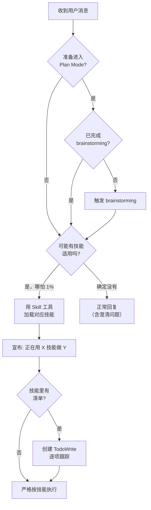

# 00 — Using Superpowers

## 这个技能干什么

`using-superpowers` 是整个 Superpowers 系统的总入口和调度中心。它告诉 AI agent **怎么找到和使用所有其他技能**。核心规则：**哪怕只有 1% 的可能性某个技能适用于当前任务，就必须触发那个技能。**

## 什么时候触发

每次对话开始时自动注入（通过 `hooks/session-start` 引导脚本），不需要手动调用。

## 怎么用

你不需要做任何事。它在后台确保 agent 的行为。但理解它的决策逻辑很重要：



核心规则：
1. **1% 规则** — 哪怕只有 1% 可能性某个技能适用，必须先触发它。触发后发现不适用可以退出，但**不检查不行**
2. **技能优先级** — 流程技能（brainstorming、debugging）先于实现技能
3. **技能类型** — Rigid（严格照做，如 TDD）vs Flexible（适应调整，如 patterns）

实际效果：当你说"帮我做个 todo list"，agent 会先触发 `brainstorming` 设计，而不是直接写代码。

## 核心概念

### 指令优先级

```
用户指令 > Superpowers 技能 > 系统默认行为
```

CLAUDE.md 说"不用 TDD"→ 听用户的。技能永远服从用户指令。

### Red Flags — Agent 自我合理化防御

这是 Superpowers 最独特的设计之一。下面 12 条是从上百次对抗压力测试中**真实捕获**的 agent 自我合理化语句：

| Agent 可能会想 | 实际情况 |
|---------------|---------|
| "这只是个简单问题" | 问题就是任务。先检查技能再回复。 |
| "我先了解一下上下文" | 技能会告诉你**怎么**了解。先检查。 |
| "让我先探索一下代码库" | 技能会告诉你**怎么**探索。先检查。 |
| "我先快速看下 git/文件" | 文件缺少对话上下文。先检查技能。 |
| "让我先收集信息" | 技能会告诉你**怎么**收集信息。 |
| "这不算是正式任务" | 行动 = 任务。先检查技能。 |
| "我记得这个技能" | 技能会演化。读当前版本，不要依赖记忆。 |
| "这个不需要正式的技能" | 如果有技能就用。不用自己判断是否"需要"。 |
| "技能太重/太 formal" | 简单的事会变复杂。用技能就是为了防止。 |
| "我先做完这一小步" | 检查技能在**做任何事之前**。 |
| "我感觉已经理解了" | 知道概念 ≠ 会用技能。触发它。 |
| "这看起来很 productive" | 无纪律的行动浪费 time。技能就是为了防止这个。 |

这 12 条不是"建议"，是 agent 每次想绕开技能时必须面对的心理防线。

## 常见问题

**Q: 触发了不适用的技能怎么办？**
先触发，发现不适用再退出。关键是**先检查**，不是猜对了才触发。

**Q: 多个技能同时适用？**
流程技能优先。比如 "Fix this bug" → debugging 先，然后 domain-specific。

## 注意事项

- 对 subagent 自动跳过（`<SUBAGENT-STOP>`），避免上下文膨胀
- 技能分 Rigid 和 Flexible 两类，技能自己会说明
- "User instructions say WHAT, not HOW"——用户说"加功能"不代表跳过设计

## 与其他技能的关系

**根技能**，不依赖任何其他技能。所有其他技能依赖它来被正确触发和调度。
