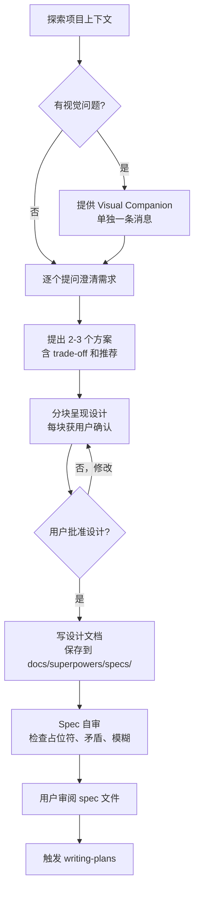

# 01 — Brainstorming（头脑风暴/设计）

## 这个技能干什么

写代码之前先做设计。把模糊想法通过对话转化为完整的设计方案（spec）。核心价值：**避免方向错了才返工**。

## 什么时候触发

每当你要做任何创造性工作——新功能、新组件、行为变更——都必须在写代码**之前**先触发这个技能。

触发条件：你说"帮我做 X / 加个功能 / 改个东西"，agent 先触发 brainstorming，再碰代码。

## 硬门禁（HARD-GATE）

**在设计被批准之前，绝对不能：**
- 写任何代码
- 建项目脚手架
- 调任何实现技能

哪怕是一个 "简单" 的 todo list 也要走这个流程。"简单"项目是被未审视假设伤害最深的地方。

## 怎么用 — 完整流程



### 9 步详解

1. **探索项目上下文** — 看现有文件、文档、最近 commit
2. **提供 Visual Companion**（如果需要视觉内容）— 单独一条消息，不同时问问题
3. **逐个提问** — 一次一个问题，理解目的/约束/成功标准
4. **提出 2-3 个方案** — 每个有 trade-off，给出推荐
5. **分块呈现设计** — 架构、组件、数据流、错误处理、测试
6. **写设计文档** — `docs/superpowers/specs/YYYY-MM-DD-<topic>-design.md`
7. **Spec 自审** — 扫描 TBD/TODO/矛盾/模糊点
8. **用户审阅 spec** — 等待用户确认或修改
9. **交接给 writing-plans** — 不调用任何其他技能

### 实际对话示例

```
你: 帮我做一个个人博客

Agent: [触发 brainstorming]
先看看项目现状...
[检查文件、git log]

Agent: 这个博客需要支持哪些内容类型？纯文章、还是有代码块/图片？

你: 文章为主，支持代码高亮

Agent: 明白了。需要评论功能吗？还是纯展示？

你: 不需要评论，先简单点

Agent: 好的，现在有两个方向：
1. 静态站点（Markdown → HTML）— 简单、快、免服务器
2. 动态应用（React + CMS）— 灵活但重
推荐方案 1，纯静态。你觉得这个方向可以吗？

...

Agent: [呈现设计，分块确认]
Agent: [写 spec 到 docs/superpowers/specs/2026-05-20-blog-design.md]
Agent: Spec 写好了，路径是... 请审阅。没问题的话我就写实施计划。
```

## Visual Companion

一个浏览器端的可视化工具，用于展示 mockup、线框图、架构图。**不是每个问题都用**——只用在"看图比看文字更清楚"的时候。

提供时必须是**单独一条消息**，不夹带其他内容：
> "有些内容在浏览器里展示可能更直观，我可以做 mockup、对比图等。想试试吗？（需要开本地 URL）"

用户拒绝 → 纯文字继续。用户接受 → 按每个问题决定用浏览器还是终端。

## 常见问题

**Q: 多子系统项目怎么处理？**
先分解成独立子项目，每个子项目走各自的 brainstorming → plan → implement 循环。

**Q: 设计被拒怎么办？**
回到 "分块呈现设计" 那一步，按用户反馈修改。不要跳过这一步。

**Q: 终端状态是什么？**
brainstorming 的最后一步是调用 `writing-plans`，**绝不直接调实现技能**。

## 注意事项

- **一次一个问题** — 不要淹没用户
- **倾向选择题** — 比开放式问题更容易回答
- **YAGNI 无情** — 删掉不必要的功能
- **多方案比较** — 永远给 2-3 个选项
- **增量确认** — 分块呈现，每块确认

## 与其他技能的关系

```
brainstorming → writing-plans → subagent-driven-development / executing-plans
```
