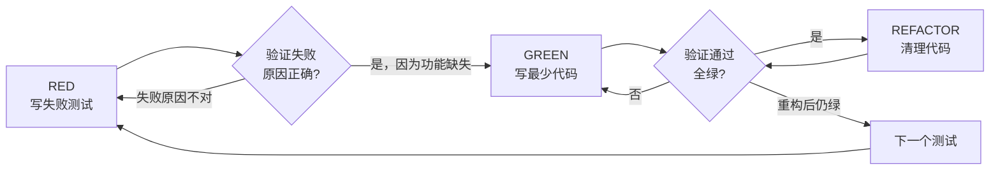

# 02 — Test-Driven Development（测试驱动开发）

## 这个技能干什么

强制执行 RED-GREEN-REFACTOR 循环：先写失败测试 → 看它失败 → 写最少代码让它过 → 看它通过 → 重构。**没有失败的测试，就不写代码。**

## 什么时候触发

任何时候写实现代码之前——新功能、bug 修复、重构、行为变更。

例外（需用户同意）：一次性原型、生成代码、配置文件。

## 铁律

```
NO PRODUCTION CODE WITHOUT A FAILING TEST FIRST
（没有先写失败测试 = 不能写生产代码）
```

在测试之前写了代码？**删掉，重来。** 不能留着"当参考"。

## 怎么用 — RED-GREEN-REFACTOR



### 完整示例 — Bug 修复

**Bug:** 空 email 被接受

**RED — 写失败测试:**
```typescript
test('rejects empty email', async () => {
  const result = await submitForm({ email: '' });
  expect(result.error).toBe('Email required');
});
```

**验证 RED:**
```bash
$ npm test
FAIL: expected 'Email required', got undefined  ← 正确：因为功能还没实现
```

**GREEN — 最少代码:**
```typescript
function submitForm(data: FormData) {
  if (!data.email?.trim()) {
    return { error: 'Email required' };
  }
  // ...
}
```

**验证 GREEN:**
```bash
$ npm test
PASS  ← 通过
```

**REFACTOR — 清理:** 如有多个字段，提取通用验证函数。

## 好测试 vs 坏测试

| 质量 | 好 | 坏 |
|------|----|----|
| **最小** | 一次测一件事 | `test('validates email and domain and whitespace')` |
| **清楚** | 名字描述行为 | `test('test1')` |
| **真实** | 尽量不用 mock | 全 mock，不测真实行为 |

## 为什么要先写测试

| 借口 | 真相 |
|------|------|
| "写完再补测试" | 之后写的测试可能测错东西，而且一写就过，证明不了什么 |
| "手动测过了" | 临时测试没有记录，不能重复跑 |
| "删掉 X 小时的工作太浪费" | 沉没成本谬误。留着不可信代码才是浪费 |
| "TDD 太教条" | TDD **就是**务实的——事前找 bug 比事后调试快得多 |

## 常见问题

**Q: 不知道怎么测？**
写你**希望**有的 API / 先写断言 / 问你的 human partner。

**Q: 测试太难写？**
设计太复杂。简化接口。

**Q: 需要 mock 一切？**
代码耦合太紧。用依赖注入。

## 注意事项

- 好的测试名：`test('retries failed operations 3 times')` ✅ `test('retry works')` ❌
- 最少代码意味着不加"未来可能需要"的参数和选项
- `testing-anti-patterns.md` 列出了更多要避免的测试坏习惯

## 与其他技能的关系

- TDD 被 `subagent-driven-development` 和 `executing-plans` 在执行过程中调用
- `systematic-debugging` 的 Phase 4 也要求用 TDD 创建回归测试
