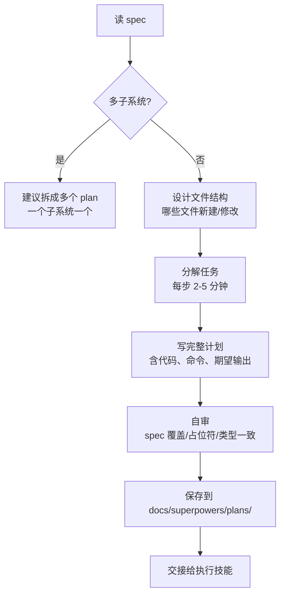

# 03 — Writing Plans（写实施计划）

## 这个技能干什么

把 brainstorming 产出的设计文档（spec）变成**可执行的任务清单**。每个任务 2-5 分钟，包含精确文件路径、完整代码、验证命令和期望输出。写给一个"零上下文、品味可疑"的工程师。

## 什么时候触发

有了设计文档（spec）后，写代码之前。brainstorming 的终端状态就是调用这个技能。

## 怎么用



### 计划结构

```markdown
# [功能名] Implementation Plan

> **For agentic workers:** REQUIRED SUB-SKILL: Use subagent-driven-development
> (recommended) or executing-plans to implement. Steps use checkbox syntax.

**Goal:** 一句话目标
**Architecture:** 2-3 句话架构方案
**Tech Stack:** 技术栈
---
```

### 任务拆分示例

```markdown
### Task 1: 验证函数

**Files:**
- Create: `src/validate.ts`
- Test: `src/validate.test.ts`

- [ ] **Step 1: 写失败测试**
  ```typescript
  test('rejects empty email', () => {
    expect(validate({ email: '' })).toContain('Email required');
  });
  ```

- [ ] **Step 2: 验证测试失败**
  运行: `npx jest validate.test.ts`
  期望: FAIL, "Email required" not found

- [ ] **Step 3: 写实现**
  ```typescript
  export function validate(data: FormData): string[] {
    const errors: string[] = [];
    if (!data.email?.trim()) errors.push('Email required');
    return errors;
  }
  ```

- [ ] **Step 4: 验证测试通过**
  运行: `npx jest validate.test.ts`
  期望: PASS

- [ ] **Step 5: 提交**
  ```bash
  git add src/validate.ts src/validate.test.ts
  git commit -m "feat: add form validation"
  ```
```

注意每一步都有**真实代码**和**确切命令**。

## 红线 — 这些绝不能出现

- "TBD" / "TODO" / "稍后实现" — **占位符 = 计划失败**
- "添加合适的错误处理" — 太模糊
- "写测试"（没有给出测试代码）— 不够具体
- "同 Task N" — 工程师可能乱序阅读，必须重复完整代码
- 引用未在任何 task 中定义的类型、函数

## 自审清单

1. **Spec 覆盖** — 每个 spec 需求都有对应的 task 吗？
2. **占位符扫描** — 有没有 TBD/TODO/模糊描述？
3. **类型一致性** — Task 3 里叫 `clearLayers()`，Task 7 里叫 `clearFullLayers()` 了吗？

## 交接

完成后提供两个执行选项：

1. **Subagent-Driven（推荐）** — 每个 task 一个独立 subagent，两阶段 review
2. **Inline Execution** — 在当前 session 逐步执行

## 常见问题

**Q: 计划写太细是不是浪费时间？**
2-5 分钟的粒度恰好——足够清晰到 agent 不偏离，又不至于琐碎。

**Q: 计划和 spec 有什么区别？**
Spec 说**要做什么**（what），Plan 说**怎么做**（how），精确到文件路径和代码。

## 与其他技能的关系

```
brainstorming (spec) → writing-plans (plan) → executing-plans 或 subagent-driven-development
```
