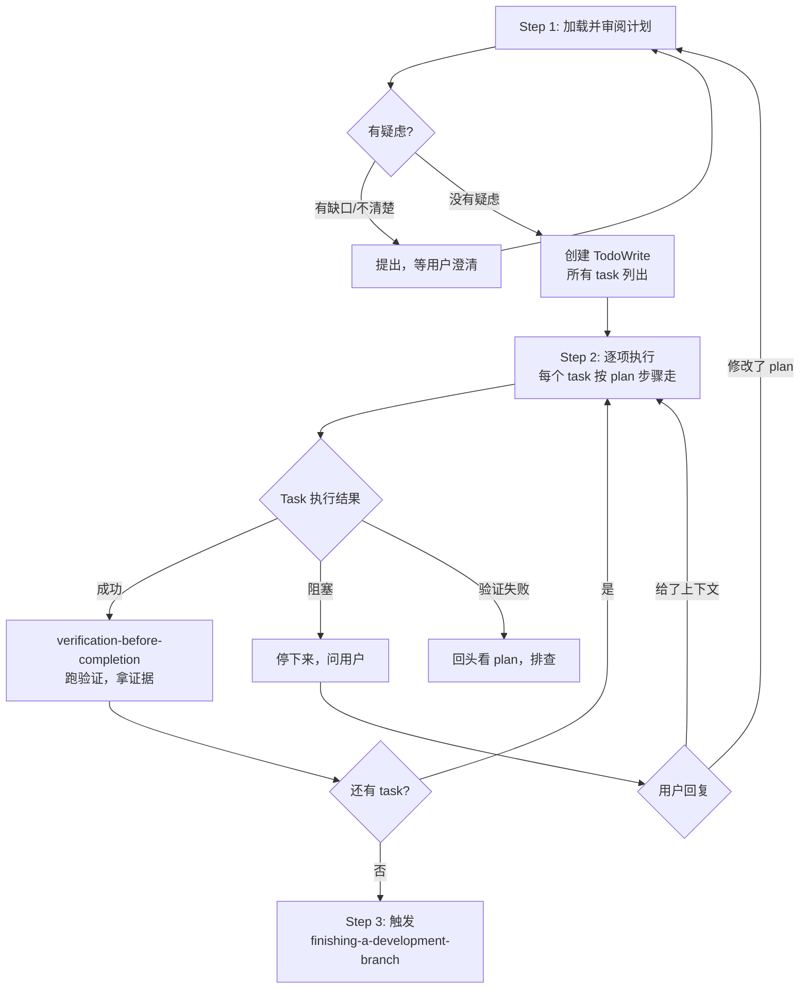

# 04 — Executing Plans（执行计划）

## 这个技能干什么

把 `writing-plans` 产出的任务清单**逐步执行**——读计划、审阅、逐项完成。这是初级执行方式，简单直接，不需要 subagent。

> **注意：** 如果你的平台支持 subagent（如 Claude Code、Codex），`subagent-driven-development` 是更推荐的执行方式，质量和效率更高。`executing-plans` 主要给不支持 subagent 的平台用。

## 什么时候触发

有一个写好的 implementation plan 要执行的时候。`writing-plans` 完成后会提供执行选项——选 "Inline Execution" 就会触发这个技能。

## 怎么用



### Step 1: 加载并审阅计划

这一步不是"打开文件开始干"，而是先批判性审阅：

1. 读 plan 文件
2. 批判性审阅——有疑问吗？有缺口吗？
3. **有疑虑 → 提出来**，等用户澄清后再开始。"盲从 plan"和"跳过 plan"一样有害
4. 没有疑虑 → 创建 TodoWrite，把所有 task 列进去

### Step 2: 逐项执行

对每个 task：

1. 标记 `in_progress`
2. 严格按 plan 的每步执行（plan 已经有 bite-sized steps，每个含代码和命令）
3. 每个 task 中调用 `test-driven-development`——RED → GREEN → REFACTOR
4. Task 完成后调用 `verification-before-completion`——跑验证命令，拿证据
5. 标记 `completed`，进入下一个

### Step 3: 完成开发

所有 task 完成、验证通过后，调用 `finishing-a-development-branch`。

## 实际对话示例

```
Agent: 我使用 executing-plans 技能来实现这个计划。

[读 plan 文件：docs/superpowers/plans/2026-05-20-blog.md]
[创建 TodoWrite：Task 1 到 Task 5]

Agent: Plan 已加载，共 5 个 task。开始执行。

--- Task 1: 项目初始化 ---

Agent: [标记 Task 1 in_progress]
      按 plan Step 1.1: 创建项目结构...
      按 plan Step 1.2: 写测试验证项目能启动...
      [调用 TDD — RED 失败 ✓]
      [调用 TDD — GREEN 通过 ✓]
      [调用 verification-before-completion — npm test: 3/3 pass ✓]
      [标记 Task 1 completed]

--- Task 2: Markdown 渲染 ---

Agent: [标记 Task 2 in_progress]
      ...

--- Task 3: 遇到阻塞 ---

Agent: Task 3 要求使用 marked 库的 highlight 选项，但 marked v12 已移除该选项。
      需要改用 marked-highlight 扩展。Plan 里写的是 v4 的 API。
      你希望我：
      1. 升级到 marked-highlight 方案
      2. 还是降级到 marked v4？

你: 用新方案吧

Agent: 明白，更新 plan 中的依赖和 API 调用，然后继续。

...

--- 全部完成 ---

Agent: 5 个 task 全部完成，测试 23/23 通过。
      [调用 finishing-a-development-branch]
      实现完成。你想怎么做？
      1. 本地合并到 main
      2. Push 并创建 PR
      3. 保持原样
      4. 丢弃
```

## 什么时候停下来问

**必须停下来、不要自己猜的情况：**

- 遇到阻塞（缺少依赖、测试反复不过、指令不清楚）
- Plan 有严重缺口（某个 task 完全无法执行）
- 不理解某个指令（不是"有点模糊"，是真的不知道要干什么）
- 验证反复失败（不是 typo，是逻辑问题）

**问的方式：** "Task N 要求 X，但实际情况是 Y。我不确定怎么做。选项：A / B / 你告诉我。"

不要：
- "Task N 可能有问题"（太模糊）
- 自己改 plan 不告诉用户
- 硬闯过不去的 test

## 什么时候回头重新审阅

- 用户根据你的反馈更新了 plan → 回到 Step 1，重新审阅整份 plan
- 基本方案需要重新思考 → 回到 Step 1
- 注意：不要因为一个 typo 就推翻整份 plan

## 常见问题

**Q: 和 subagent-driven-development 怎么选？**
有 subagent → SDD（更快、质量更高）。没有 subagent → executing-plans。同一个 plan 可以在不同平台用不同执行方式。

**Q: 执行中发现 plan 有问题怎么办？**
停下来，告诉用户：具体哪个 task、什么问题、你建议怎么改。让用户决定，不要擅自改 plan。

**Q: 一个 task 做了超过 10 分钟还没完？**
Task 可能太大。停下来，看看是不是该拆成两个。告诉用户。

**Q: 能不能跳过一个 task 先做后面的？**
除非 task 之间有明确的独立关系且你确认没有依赖，否则不要跳。Plan 的任务顺序通常是有原因的（前面定义了后面要用的类型/接口）。

## 注意事项

- **绝不在 main/master 分支上直接实现**——需要用户明确同意
- 不要跳过 plan 里指定的验证步骤
- Plan 里让你调用什么其他技能你就调用
- 执行前先审阅，不要盲从——agent 的责任是**执行 + 质疑**
- 不要因为"感觉没问题"就跳过 verification——每次 task 完成后验证

## 与其他技能的关系

```
writing-plans → executing-plans → finishing-a-development-branch
                     ↑
            需要 using-git-worktrees（确保隔离工作区）
                     ↑
            test-driven-development（每个 task 内的质量底线）
                     ↑
            verification-before-completion（每个 task 后的证据门禁）
```
