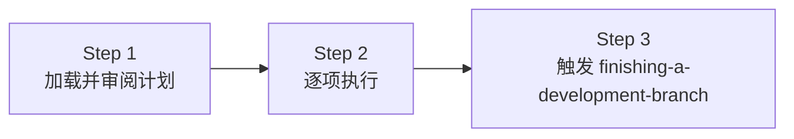

# 04 — Executing Plans（执行计划）

## 这个技能干什么

把 `writing-plans` 产出的任务清单**逐步执行**——读计划、审阅、逐项完成。这是初级执行方式，简单直接，不需要 subagent。

> **注意：** 如果你的平台支持 subagent（如 Claude Code、Codex），`subagent-driven-development` 是更推荐的执行方式，质量和效率更高。`executing-plans` 主要给不支持 subagent 的平台用。

## 什么时候触发

有一个写好的 implementation plan 要执行的时候。

## 怎么用



### Step 1: 加载并审阅

1. 读 plan 文件
2. 批判性审阅——有疑问吗？有缺口吗？
3. 有疑虑 → 提出，等用户澄清
4. 没有疑虑 → 建 TodoWrite，开始执行

### Step 2: 逐项执行

对每个 task：
1. 标记 `in_progress`
2. 严格按 plan 的每步执行（plan 已经有 2-5 分钟的 bite-sized steps）
3. 按 plan 指定的命令验证
4. 标记 `completed`

### Step 3: 完成开发

所有 task 完成后调用 `finishing-a-development-branch`。

## 什么时候停下来问

- 遇到阻塞（缺依赖、测试反复不过、指令不清楚）
- Plan 有严重缺口
- 不理解某个指令
- **不要猜，不要硬闯**

## 什么时候回头看

- 用户根据你的反馈更新了 plan
- 基本方案需要重新思考

## 常见问题

**Q: 和 subagent-driven-development 怎么选？**
有 subagent → 用 SDD。没有 subagent → 用 executing-plans。

**Q: 执行中发现 plan 有问题怎么办？**
停下来，告诉用户具体的缺口，不要自己擅自改 plan。

## 注意事项

- **绝不在 main/master 分支上开始实现**——需要用户明确同意
- 不要跳过验证步骤
- Plan 里让你调用什么技能你就调用
- 执行前先审阅，不要盲从 plan

## 与其他技能的关系

```
writing-plans → executing-plans → finishing-a-development-branch
                     ↑
            需要 using-git-worktrees（确保隔离工作区）
```
