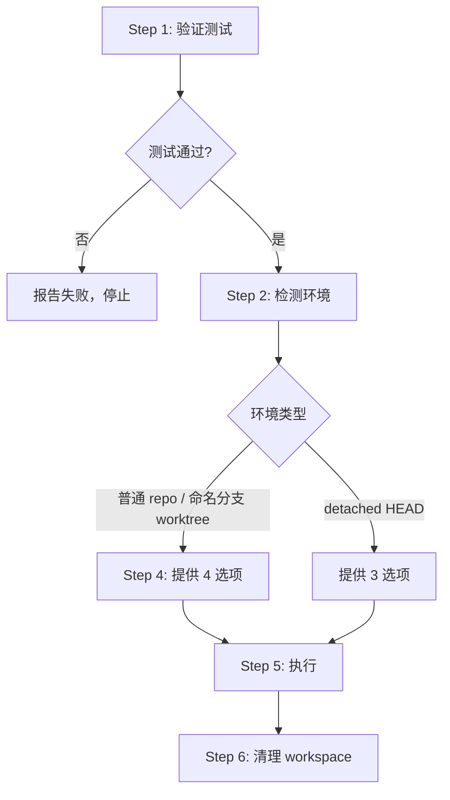

# 06 — Finishing a Development Branch（完成开发分支）

## 这个技能干什么

开发完成后的收尾：验证测试 → 检测环境 → 提供 4 个结构化选项 → 执行选择 → 清理。

不问你"接下来做什么？"的开放式问题，而是给精确的选项菜单。

## 什么时候触发

所有开发任务完成、测试通过后。是 `executing-plans` 或 `subagent-driven-development` 的终端状态。

## 怎么用



### 4 个标准选项

1. **本地合并** → merge 到 base branch → 验证 → 清理 worktree → 删分支
2. **Push + 建 PR** → push → `gh pr create` → **保留 worktree**（留给 PR 迭代）
3. **保持原样** → 不合并不删除，你自己后面处理
4. **丢弃** → **需输入 "discard" 确认** → 删分支 → 清理 worktree

### 选项和执行对照

| 选项 | 合并 | Push | 保留 Worktree | 清理分支 |
|------|------|------|--------------|---------|
| 1. 合并 | ✅ | - | - | ✅ |
| 2. PR | - | ✅ | ✅ | - |
| 3. 保持 | - | - | ✅ | - |
| 4. 丢弃 | - | - | - | ✅ (强制) |

## 常见错误

| 错误 | 问题 | 改正 |
|------|------|------|
| 跳过测试验证 | 合并坏的代码 | **永远**先验证测试 |
| 开放式问题 | "接下来做什么？"太模糊 | 给精确 4 个选项 |
| 选项 2 后清理 worktree | 删了用户 PR 迭代需要的环境 | 选项 2、3 保留 worktree |
| 先删分支再删 worktree | `git branch -d` 失败 | 先合并 → 删 worktree → 删分支 |
| 在 worktree 内部跑 `git worktree remove` | 命令静默失败 | 先 cd 到主 repo 根 |
| 没有 discard 确认 | 误删工作 | 要求输入 "discard" |

## 环境检测

用 `GIT_DIR` vs `GIT_COMMON` 来判断：
- 相等 → 普通 repo，4 选项
- 不等 + 有分支名 → 命名 worktree，4 选项
- 不等 + detached HEAD → 外部管理工作区，3 选项（没有本地合并）

## 清理规则

**只清理 Superpowers 创建的 worktree**（路径在 `.worktrees/`、`worktrees/`、`~/.config/superpowers/worktrees/` 下）。其他来源的 workspace 由宿主环境管理，不要碰。

## 注意事项

- 合并后要再跑一次测试，确保 merge 没引入问题
- force-push 除非用户明确要求，否则永远不做
- 永远用 `git worktree prune` 做 self-healing

## 与其他技能的关系

```
subagent-driven-development / executing-plans → finishing-a-development-branch → 结束
```
