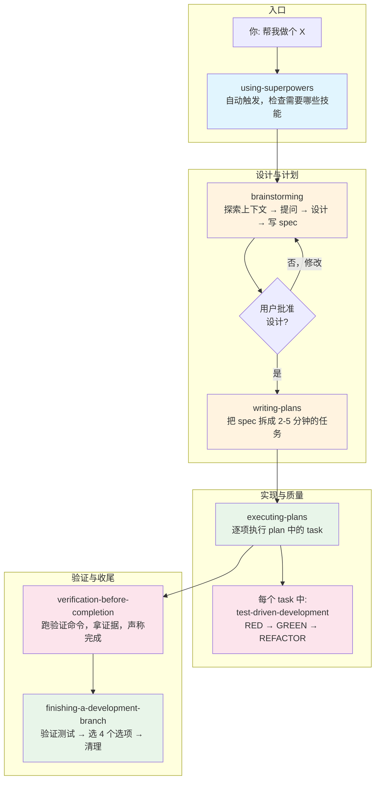
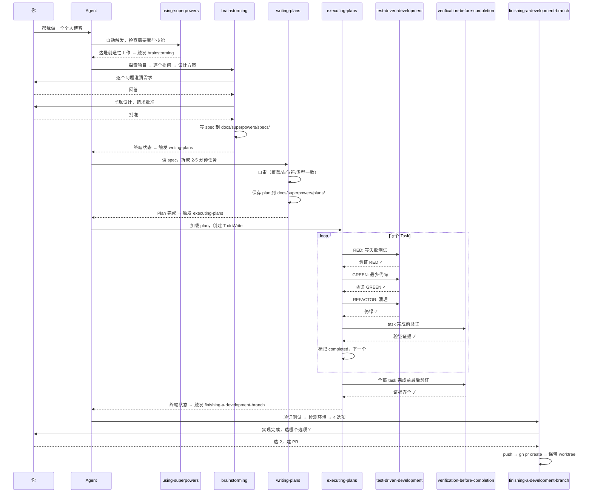
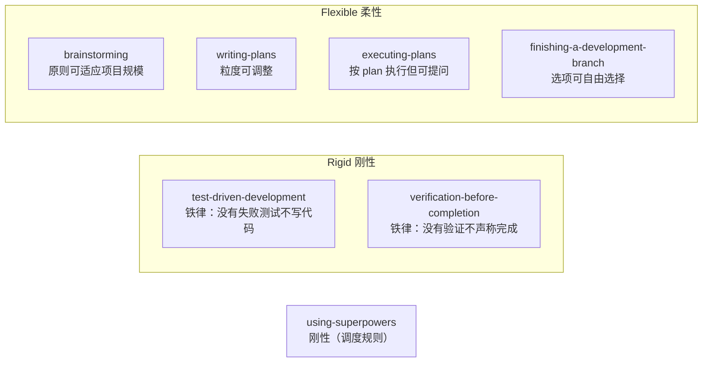

# Superpowers 初级 — 核心管线

## Superpowers 是什么

Superpowers 是一套**为 AI Coding Agent 设计的软件开发方法论**。它不是代码库，不是框架，而是一组**技能（Skills）**——每个技能是一个 md 文档，告诉 AI agent 在特定场景下该怎么思考、怎么做。

这套方法论由一个关键洞察驱动：AI agent 在压力下会和人类一样走捷径——跳过设计直接写代码、不写测试、猜 bug 原因、声称修好了但没验证。Superpowers 的每个技能就是在这些关键节点上设"门禁"，用结构化的流程防止 agent 走向低质量决策。

### 核心理念

**1. 流程优先于实现（Process over implementation）**

Superpowers 最大的信念：**写代码是最不重要的环节。** 最重要的环节是写代码之前的思考和设计。所以整套系统的起点不是"怎么写"，而是"为什么要做这个、做给谁、做什么、怎么做成小步骤"。

大多数失败的 AI 编程体验都是因为 agent 直接跳进代码——方向错了，后面全是返工。Superpowers 强制 agent 在碰代码之前走完设计→计划的完整流程。

**2. 铁律与门禁（Iron Laws and Gates）**

Superpowers 不给建议，给定律。每个 discipline-enforcing 技能都有一条"Iron Law"：
- TDD：没有失败的测试，不能写生产代码
- 系统调试：没有根因分析，不能提修复方案
- 完成前验证：没有刚跑的验证证据，不能说完成

这些不是"最好这么做"的建议，是"不这么做就是错的"的硬约束。背后逻辑：agent 和人类一样会在压力下合理化自己的捷径，只有铁律才能挡住这种合理化。

**3. 防御心理合理化（Rationalization Defense）**

这是 Superpowers 最独特的设计。每个 rigid 技能都包含一个"借口 vs 真相"表格和 Red Flags 列表，针对 agent 在实际压力测试中**真实使用过**的自我合理化语句进行反驳。这些不是编的，是从上百次对抗测试中捕获的。

例如 TDD 技能里：
| 借口 | 真相 |
|------|------|
| "太简单了不需要测试" | 简单代码也会坏，30 秒写个测试 |
| "删掉 X 小时的工作太浪费" | 沉没成本谬误，留着不可信代码才是浪费 |
| "手动测过了" | 临时测试无记录，不可重复跑 |

这不是写给 agent 看的，是**写给压力下的 agent 看**的——当它累了、烦了、想走捷径的时候，这些文字会跳出来拦住它。

**4. 证据先行，声称在后（Evidence before claims）**

Superpowers 的核心价值观：没有验证的命令输出 = 没有资格说完成。这在 `verification-before-completion` 技能里被编码成门禁函数——每次声称之前必须识别验证命令、执行、读输出、证实、然后才能说完成。跳过任何一步 = 撒谎。

这背后是 24 个真实失败案例的教训——用户说"我不信你"、未定义函数被上线、假完成导致返工。

**5. "你的 human partner"（Human Partner over User）**

Superpowers 刻意使用"your human partner"而不是"the user"。这不是文字游戏——它建立了一种合作关系的框架，agent 是协作者而非工具。用户指令是最高优先级（高于技能规则），agnt 有责任在盲从和质疑之间找到正确的位置。

---

## 初级管线的设计哲学

初级包含 7 个技能，构成从 idea 到交付的**最小完整闭环**。选这 7 个有明确逻辑：

### 为什么是这 7 个

一个独立开发者要完成一个项目，需要回答 7 个问题：

1. 这个系统怎么运作？（using-superpowers）
2. 我要做什么？（brainstorming → spec）
3. 怎么做？（writing-plans → plan）
4. 怎么执行？（executing-plans）
5. 怎么保证质量？（test-driven-development）
6. 怎么确认做完了？（verification-before-completion）
7. 怎么收尾？（finishing-a-development-branch）

任何一个问题没回答，流程就会断裂。

### 选入标准

- **必须性**：缺了它，流程有缺口。不是"nice to have"
- **独立性**：不依赖平台特定功能（如 subagent）。初级技能在 Claude Code、Codex、Gemini CLI 等任何平台上都能用
- **基础性**：是其他高级技能的前置依赖。比如初级建立了 TDD 习惯后，中级的 SDD 才能发挥作用

### 排除标准

- `using-git-worktrees`：初级执行不强制隔离工作区（可在普通 repo 分支上工作）
- `subagent-driven-development`：初级用 `executing-plans` 作为更简单的替代
- `systematic-debugging`：初级项目规模和复杂度下，TDD + 验证基本能覆盖问题
- `requesting-code-review` / `receiving-code-review`：初级项目单人即可完成
- `dispatching-parallel-agents`：依赖 subagent，且初级项目规模不需并行
- `writing-skills`：元技能，创建技能才需要

---

## 完整工作流

### 流程中的技能触发点

### 每个技能在流程中的位置和职责

| 序号 | 技能 | 阶段 | 输入 | 输出 | 一句话 |
|------|------|------|------|------|--------|
| 00 | using-superpowers | 总调度 | 用户消息 | 技能调用决策 | 确保正确的技能在正确的时间被触发 |
| 01 | brainstorming | 设计 | 模糊想法 | 设计文档（spec） | 把想法变成经过审视的设计 |
| 02 | test-driven-development | 编码纪律 | 要实现的功能 | 测试→代码→重构 | 每个 task 执行时的质量底线 |
| 03 | writing-plans | 计划 | spec | 可执行的任务清单 | 把设计变成精确到代码的实施步骤 |
| 04 | executing-plans | 执行 | plan | 完成的代码 | 逐项执行，遇阻即停 |
| 05 | verification-before-completion | 验证 | 代码变更 | 验证证据 | 声称之前先证明 |
| 06 | finishing-a-development-branch | 收尾 | 完成的代码 | merge/PR/丢弃 | 结构化地结束开发 |

### 技能的两种工作模式

初级 7 个技能有两种不同的工作模式：

**持续有效型（Session-long）**：触发后在整个 session 中持续约束 agent 行为。
- `using-superpowers`：整个 session 的技能调度
- `test-driven-development`：每次写代码都受约束
- `verification-before-completion`：每次声称完成都受约束

**阶段门禁型（Phase Gate）**：在特定阶段触发，完成后退出，进入下一阶段。
- `brainstorming` → `writing-plans` → `executing-plans` → `finishing-a-development-branch`

这个四阶段管线就是 Simon Sinek 的 Golden Circle 在软件开发中的应用：
- **Why**（brainstorming）：为什么做这个，解决什么问题
- **What**（writing-plans）：做什么，做到什么程度
- **How**（executing-plans + TDD + verification）：怎么做，怎么知道做对了
- **Done**（finishing）：怎么收尾

---

## 技能刚性层级

Superpowers 技能分为两类——区别很重要，因为刚性技能不容 agent 自行"适应"：

**刚性技能**不是说"最好这样做"，而是说"不这样做就是错的"。它们包含 Iron Law、借口反驳表、Red Flags 列表。agent 对这些技能的态度必须是服从，不是协商。

**柔性技能**提供结构化的过程，但允许在上下文中灵活调整。brainstorming 对于一个简单项目可能只花 3 分钟，对一个复杂系统可能花 30 分钟，但都要走完 9 个步骤。

---

## Superpowers 的 coding 价值观

Superpowers 不谈抽象的"工程最佳实践"。它把具体的价值观编码进技能文本里：

### YAGNI（You Aren't Gonna Need It）

贯穿 brainstorming 和 writing-plans。设计阶段就删掉不需要的功能。多方案比较时那个"更复杂但更灵活"的方案默认不选——除非你现在**确定**需要灵活。

### DRY（Don't Repeat Yourself）

在 writing-plans 中体现——plan 里不该出现"同 Task N"这种偷懒写法。每个 task 自包含完整信息。

### TDD（Test-Driven Development）

不是"写了测试就行"，而是严格的 RED→GREEN→REFACTOR 循环。test-driven-development 技能里有 11 条借口 vs 真相，6 条 Red Flags，每一句都是从真实 session 中 agent 的真实"逃课"行为里提炼出来的。

### 验证主义（Verificationism）

"证据先行"是 Superpowers 最核心的价值取向之一。它不信任 agent 的判断，只信任命令输出。这是从 24 个失败案例中学到的。

---

## 初级 vs 中高级的关系

初级管线是 Superpowers 的"最小可行方法论"。学完初级 7 个技能，你就能：

- 从零到一完成任何一个独立项目（网页、CLI 工具、API、脚本）
- 确保代码有测试保护
- 确保完成的质量是可验证的
- 形成结构化的开发节奏

初级解决的是"**能不能做出来**"的问题。

中级解决的是"**能不能更快更好地做出来**"的问题——引入工作区隔离、subagent 并行、系统化调试、代码 review。

高级解决的是"**能不能扩展这套方法论本身**"的问题——并行调度多个 agent、用 TDD 方法创造新技能。

但初级永远是基础。如果一个 agent 连 brainstorming → TDD → verification 这条基本线都守不住，给它的 subagent 越多只会错得越快。

---

## 新手学习建议

### 学习顺序

1. **先理解 using-superpowers**（00）——明白为什么 agent 会在你说"加个按钮"时先去设计而不是写代码
2. **体验一次完整流程**——跟 agent 说"帮我做个小项目"，观察它走完 01→06 的全过程
3. **重点消化 TDD**（02）——这是初级里最硬核的技能。花时间理解 RED-GREEN-REFACTOR 循环，特别是"为什么要先看到失败"
4. **把 verification-before-completion**（05）背下来——"没事，应该过了"这句话是万恶之源

### 成功标志

当你发现：
- agent 在没有 spec 的情况下不肯写代码 → brainstorming 生效了
- agent 写了代码之后主动跑测试并告诉你结果 → verification-before-completion 生效了
- 你自己开始对 agent 说"先写测试" → TDD 内化了
- 项目结束后代码有 spec 文档、plan 文档、测试覆盖 → 整个管线跑通了

这时候你就是一个合格的 Superpowers 初级使用者了。
