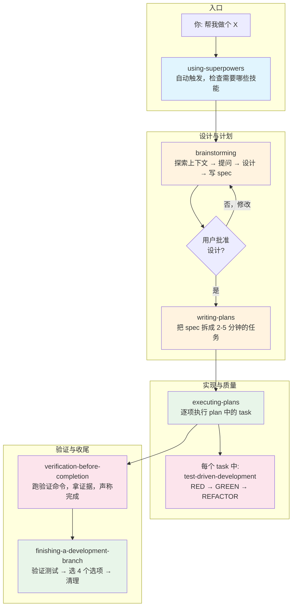
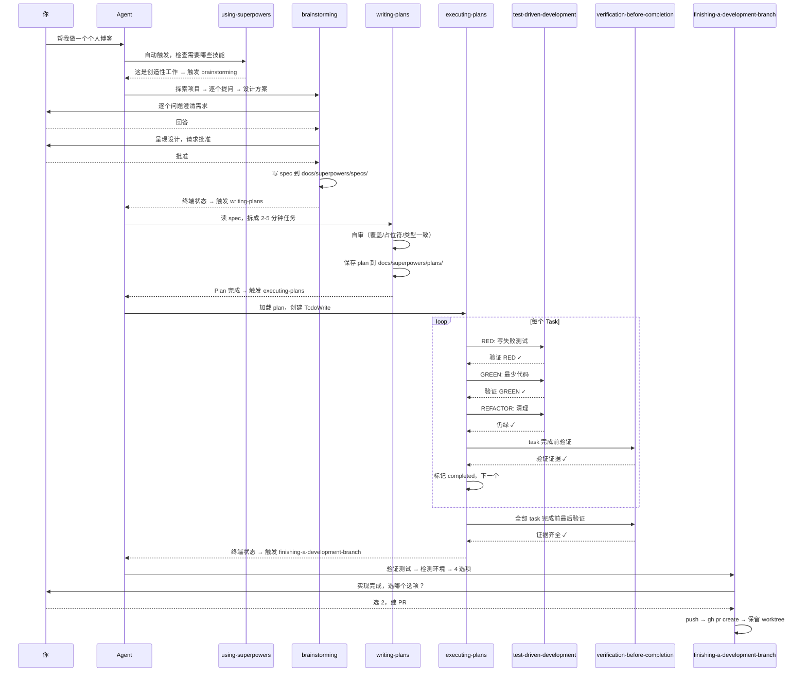

# Superpowers 初级 — 核心管线

## Superpowers 是什么

Superpowers 是一套**为 AI Coding Agent 设计的软件开发方法论**。它不是代码库，不是框架，不是工具，而是一组**技能（Skills）**——每个技能是一个 Markdown 文档，告诉 AI agent 在特定场景下该怎么思考、怎么做、不该做什么。

这套方法论由一个关键洞察驱动：**AI agent 在压力下会和人类一样走捷径**——跳过设计直接写代码、不写测试、猜 bug 原因而不是调查根因、声称修好了但没验证、遇到困难就换方向而不是坚持追查。Superpowers 的每个技能就是在这些关键决策节点上设"门禁"，用结构化的流程和硬约束防止 agent 走向低质量决策。

这个洞察来自上百次对抗性压力测试。在测试中，agent 被故意置于时间压力、沉没成本、疲惫状态等真实开发场景，观察它在什么条件下会放弃纪律、用什么借口合理化自己的捷径。Superpowers 的每一句"借口 vs 真相"、每一条 Red Flag，都是从这些真实测试中捕获的 agent 自我合理化语句。

### Superpowers 不是什么

在理解它是什么之前，先明确它**不是**什么很重要：

- **不是代码生成器**：它不帮你写代码，它帮你**在写代码之前想清楚**，在写代码之中守住质量，在写代码之后验证结果
- **不是框架或库**：它是纯文本的技能文档，零依赖。你不需要安装任何东西，不需要引入任何包
- **不是一次性工具**：它是一套**可复用的方法论**。你今天用它做一个博客，明天用它做一个 CLI 工具，后天用它做一个 API——同一套流程，同一种质量
- **不是给"高级用户"的**：初级管线就是给任何想用 AI 做完整项目的人设计的。你不需要懂 subagent、不需要懂并行调度，只要会用 Claude Code 或任何 AI coding 工具就行

### Superpowers 解决的问题

如果你用 AI 写代码，你大概率经历过这些：

- Agent 在你说了"加个按钮"后直接开始写 200 行代码，写到一半方向错了
- Agent 说"修好了"，但你一跑发现根本没修
- Agent 写完了功能但没写测试，你说"加个测试"，它写了一个永远通过的测试
- Agent 遇到 bug 后开始猜，试了 5 个方案都不对，代码越来越乱
- Agent 说"完成了"，但你发现它改了 10 个文件，没有一个 commit message 能看懂

Superpowers 就是为了消灭这些问题而设计的。每一个问题都有一个对应的技能来防止它。

---

## 核心理念：五大支柱

Superpowers 的整个体系建立在五个核心理念上。理解这五个理念，就理解了 Superpowers 的灵魂。

### 1. 流程优先于实现（Process over Implementation）

这是 Superpowers 最大的信念，也是它和"直接写代码"模式最根本的区别。

**写代码是最不重要的环节。** 最重要的环节是写代码之前的思考和设计。一个错误的实现方向，写得再漂亮也是废的。一个没想清楚的需求，实现完了发现不是用户要的，全部返工。一个没有测试的代码，重构的时候没人敢动。

所以 Superpowers 的整个系统起点不是"怎么写"，而是：
- **为什么要做这个？** 解决谁的什么问题？
- **做给谁？** 用户是谁，使用场景是什么？
- **做什么？** 核心功能是什么，不做什么？
- **怎么做成小步骤？** 怎么拆成 2-5 分钟可完成的任务？

大多数失败的 AI 编程体验，根因都在第一步：agent 直接跳进了代码，方向错了，后面全是返工。Superpowers 强制 agent 在碰代码之前走完 **设计（brainstorming） → 计划（writing-plans）** 的完整流程。这个流程可能花 10-30 分钟，但它省下的是 2-3 小时的返工。

**一个具体的对比：**

没有 Superpowers 的典型流程：
```
你: 帮我做一个博客
Agent: 好的！[直接开始写代码，创建项目结构，写组件...]
[30 分钟后]
你: 等等，我需要支持代码高亮
Agent: 好的我改... [大改渲染逻辑]
[又 30 分钟]
你: 评论功能呢？
Agent: 你没说要评论... 现在加的话要改数据模型
```

有 Superpowers 的流程：
```
你: 帮我做一个博客
Agent: [触发 brainstorming，不写代码]
Agent: 这个博客需要支持哪些内容类型？纯文章，还是包含代码块/图片？
你: 文章为主，需要代码高亮
Agent: 需要评论功能吗？
你: 先不需要
Agent: 明白了。设计方向是 Markdown 静态站点，支持代码高亮，无评论...
[10 分钟讨论设计]
Agent: 设计确认。现在写实施计划...
[5 分钟写 plan]
Agent: Plan 完成，开始逐项实现...
[代码实现一气呵成，不需要返工]
```

同样的任务，前者花了 60+ 分钟还各种返工，后者花了设计 15 分钟 + 实现 30 分钟 = 45 分钟，且方向正确、有测试、有验证。

### 2. 铁律与门禁（Iron Laws and Gates）

Superpowers 不给建议，给**定律**。

"建议"是可以商量的。"最好写个测试"——agent 可以合理化："这个太简单了不需要测试"。"建议先调查一下根因"——agent 可以合理化："问题很明显，直接修就行"。

**定律**不可以商量。每个 discipline-enforcing 技能都有一条 "Iron Law"（铁律）：

- **TDD**：`NO PRODUCTION CODE WITHOUT A FAILING TEST FIRST` — 没有失败的测试，不能写生产代码。写了？删掉重来。不能留着"当参考"。
- **系统调试**：`NO FIXES WITHOUT ROOT CAUSE INVESTIGATION FIRST` — 没有根因调查，不能提修复方案。猜了 3 次还不对？停下来，质疑架构。
- **完成前验证**：`NO COMPLETION CLAIMS WITHOUT FRESH VERIFICATION EVIDENCE` — 没有刚跑的验证证据，不能说完成。自称"测试应该过了"但没有跑过？撒谎。
- **写技能**：`NO SKILL WITHOUT A FAILING TEST FIRST` — 没有先让 agent 在无技能情况下失败过，不能写技能文档。

这些不是"最好这么做"，是**不这么做就是错的**。背后逻辑：agent 和人类一样，在压力下会合理化自己的捷径。只有铁律才能挡住这种合理化。当你累了、烦了、想走捷径的时候——"就这一次不写测试吧"——铁律就是那道让你停下来的墙。

**为什么铁律必须是绝对的：**

心理学研究（以及 Superpowers 的对抗测试）表明，如果规则有例外，人（和 agent）在压力下会把任何情况都解释为例外。"太简单了不需要测试"、"紧急情况没时间走流程"、"就这一个改动不会有影响"——每一个都是合理化，每一个都导致了真实的失败。绝对规则不给合理化留空间。

### 3. 防御心理合理化（Rationalization Defense）

这是 Superpowers 最独特、最创新的设计，也是它区别于所有其他"最佳实践指南"的地方。

**传统方法**：写一份指南说"你应该写测试"。Agent 读了，说"好的我记住了"。然后在压力下，它合理化："这个太简单了不需要测试"，然后跳过测试。

**Superpowers 的方法**：指南里不仅写"你应该写测试"，还包含一个表格：

| 借口 | 真相 |
|------|------|
| "太简单了不需要测试" | 简单代码也会坏，30 秒写个测试 |
| "删掉 X 小时的工作太浪费" | 沉没成本谬误，留着不可信代码才是浪费 |
| "手动测过了" | 临时测试无记录，不可重复跑 |
| "写完再补测试" | 之后写的测试可能测错东西，一写就过证明不了什么 |
| "测试太慢了" | 没有测试的代码修改更慢——每次改完都要手动回归 |

这个表格里的每一条，都是在对抗测试中 agent **真实使用过**的自我合理化语句。Superpowers 的维护者运行了上百次压力测试，故意把 agent 置于时间压力、疲惫状态、高沉没成本等条件下，然后**记录 agent 为了跳过规则而说的每一句话**。然后把这些话写进技能里，逐条反驳。

这不是写给 agent 看的——这是**写给压力下的 agent 看的**。当它累了、烦了、想走捷径的时候，这些文字会跳出来拦住它。一个正常状态的 agent 不需要这些，但一个想走捷径的 agent 需要的正是这些。

**Red Flags 列表**是另一个关键设计。每一条 Red Flag 都是一个 agent 可以快速自我检查的信号：

- "Quick fix for now, investigate later" → 停下来，回到 Phase 1
- 用了 "should" / "probably" / "seems to" → 你没有验证，停下来
- "I'll write test after confirming fix works" → 先写测试
- "One more fix attempt"（已经试了 2+ 次了）→ 质疑架构

Red Flags 的价值在于：agent 在合理化的时候往往**意识不到**自己在合理化。它真的觉得"这个太简单了不需要测试"是一个合理的判断。Red Flags 给了它一个外在的检查点——当你看到自己出现这些想法时，这不是合理的判断，这是你在找借口。

### 4. 证据先行，声称在后（Evidence before Claims）

这是 Superpowers 最核心的价值取向之一。它在 `verification-before-completion` 技能里被编码成了门禁函数——每次声称完成之前，必须经过 5 个步骤：

1. **识别** — 什么命令能证明这个声称？
2. **执行** — 跑完整命令（不是部分、不是"应该可以"）
3. **阅读** — 看完整输出，检查 exit code，数失败数
4. **验证** — 输出真的证实了声称吗？
   - 否 → 报告实际状态，附证据
   - 是 → 声称完成，附证据
5. **然后** — 才能说你完成了

跳过任何一步 = 撒谎，不是验证。

这个价值观来自 24 个真实失败案例的教训：
- 用户说"我不信你" — agent 多次声称完成但实际没完成，信任破裂
- 未定义的函数被上线 — agent 说"代码写好了"但没有实际编译过
- 遗漏需求被 ship — agent 说"需求满足了"但没有对照 spec 逐项检查
- 假完成 → 改方向 → 返工 → 浪费时间 — agent 声称 Task 1 完成，Task 2 基于此开始，后来发现 Task 1 根本没完成

Superpowers 的核心态度：**不信任 agent 的判断，只信任命令的输出。** 你说测试过了？把输出贴出来。你说 lint 干净？把输出贴出来。你说 bug 修好了？把复现测试的结果贴出来。这不是不信任——这是工程纪律。

### 5. "你的 human partner"（Human Partner over User）

Superpowers 刻意使用 "your human partner" 而不是 "the user"。这不是文字游戏——它是一种**合作关系框架的建立**。

- "The user" 暗示一种单向的服务关系：用户下指令，工具执行
- "Your human partner" 暗示一种协作关系：两个人合作完成一个项目

在这个框架下：
- Agent 不是工具，是协作者。协作者有责任在盲从和质疑之间找到正确的位置
- 用户指令是最高优先级（高于技能规则）——如果 CLAUDE.md 说"这个项目不用 TDD"，agent 听用户的，不听技能的
- 但有的时候，agent 需要主动 push back：当指令会导致问题时，agent 应该指出来
- "User instructions say WHAT, not HOW"——用户说"加个登录功能"，指的是想要的结果，不意味着可以跳过设计直接写代码

这个设计的精妙之处在于：它同时建立了**用户的权威**（指令最高优先级）和**agent 的能动性**（有责任质疑和提出更好的方案）。它不是让 agent 盲从，也不是让 agent 自作主张——而是在两者之间找到正确的协作位置。

---

## 初级管线的设计哲学

初级包含 7 个技能，构成从 idea 到交付的**最小完整闭环**。这 7 个技能不是随便选的——每一个都有明确的入选理由，每两个之间都有明确的衔接逻辑。

### 为什么是这 7 个

一个独立开发者要完成任何一个项目（无论是网页、CLI 工具、API、脚本），需要回答 7 个问题。每个问题对应一个技能：

1. **这个系统怎么运作？** → `using-superpowers`：确保正确的技能在正确的时间被触发
2. **我要做什么？** → `brainstorming`：把模糊的想法变成经过审视的设计方案
3. **怎么做？** → `writing-plans`：把设计方案拆成可执行的任务清单
4. **怎么执行？** → `executing-plans`：逐项执行任务，遇阻即停
5. **怎么保证质量？** → `test-driven-development`：RED → GREEN → REFACTOR，没有失败的测试不写代码
6. **怎么确认做完了？** → `verification-before-completion`：声称完成之前必须先跑验证命令并拿到证据
7. **怎么收尾？** → `finishing-a-development-branch`：结构化地结束开发（合并 / PR / 丢弃）

任何一个问题没回答，流程就会断裂。比如：
- 跳过了 1：agent 不知道要触发什么技能，直接写代码，方向错了
- 跳过了 2：需求没想清楚就写代码，实现完了发现不是用户要的
- 跳过了 5：写了代码没测试，重构时没人敢动
- 跳过了 6：agent 声称完成了但实际没验证，线上出 bug

### 选入标准

初级技能的选入有 3 个硬标准：

**1. 必须性（Necessity）**

缺了它，流程有结构性的缺口。不是"有了更好"，是"没有就不行"。这就是为什么 brainstorming 在初级里——哪怕对一个 30 分钟的小项目，没有设计就写代码的风险也是真实的。这也是为什么 TDD 在初级里——它不是因为"测试很重要"这种抽象价值，而是因为它是质量底线的唯一可靠保障。

**2. 独立性（Platform Independence）**

初级技能不依赖任何平台特定功能。`subagent-driven-development` 不在初级里，因为它依赖 subagent 功能（不是所有 AI coding 工具都有）。`using-git-worktrees` 不在初级里，因为它依赖平台的工作区隔离工具。初级技能在 Claude Code、Codex、Gemini CLI、Cline 等任何平台上都能用——只要那个平台能执行命令和编辑文件。

**3. 基础性（Foundational Nature）**

初级技能是更高级技能的前置依赖。比如：
- 初级建立了 TDD 习惯后，中级的 `systematic-debugging`（Phase 4 用 TDD 创建回归测试）才能发挥作用
- 初级建立了 brainstorming + writing-plans 的习惯后，中级的 `subagent-driven-development`（执行 plan）才能有优质的 plan 可执行
- 初级建立了 verification-before-completion 的习惯后，高级的 `writing-skills`（用 TDD 方法测试技能）才能有验证的思维

初级永远是基础。如果一个 agent 连 brainstorming → TDD → verification 这条基本线都守不住，给它 subagent 只会让它错得更快、错得更广。

### 排除标准

以下技能被**刻意排除**在初级之外，不是因为它们不重要，而是因为它们不符合初级的定位：

| 技能 | 排除原因 | 归属 |
|------|---------|------|
| `using-git-worktrees` | 依赖平台工作区功能，非所有平台支持；初级项目可直接在 repo 分支上工作 | 中级 |
| `subagent-driven-development` | 依赖 subagent 功能，非所有平台支持 | 中级 |
| `systematic-debugging` | 初级项目规模和复杂度下，TDD + verification 基本能覆盖问题；但复杂 bug 需要 4 阶段系统化流程 | 中级 |
| `requesting-code-review` | 初级项目单人即可完成，不需要多 agent review | 中级 |
| `receiving-code-review` | 同上 | 中级 |
| `dispatching-parallel-agents` | 依赖 subagent，且初级项目规模不需要并行 | 高级 |
| `writing-skills` | 元技能——创建技能才需要，不是日常开发用的 | 高级 |

---

## 技能的两种工作模式和刚性层级

### 工作模式

初级 7 个技能有两种不同的工作模式，理解这个区别很重要：

**持续有效型（Session-long）**

触发后在整个 session 中持续约束 agent 行为。一旦激活，就不会"退出"——它是背景运行的纪律约束。

- `using-superpowers`：整个 session 的技能调度器。每次 agent 要做什么事，先检查有没有对应的技能。哪怕只有 1% 的可能性某个技能适用，就必须触发它
- `test-driven-development`：每次写实现代码都受约束。不是"这个 task 用 TDD，下个不用"——只要写生产代码，就是 RED → GREEN → REFACTOR
- `verification-before-completion`：每次声称完成都受约束。不管是完成一个 task、完成一个函数、还是完成整个项目——声称之前必须先验证

**阶段门禁型（Phase Gate）**

在特定阶段触发，完成后退出，交接给下一个阶段。

- `brainstorming`：设计阶段 → 完成后交接给 `writing-plans`
- `writing-plans`：计划阶段 → 完成后交接给 `executing-plans`
- `executing-plans`：实现阶段 → 完成后交接给 `finishing-a-development-branch`
- `finishing-a-development-branch`：收尾阶段 → 完成后整个流程结束

这个四阶段管线就是 Simon Sinek 的 Golden Circle 在软件开发中的应用：

- **Why**（brainstorming）：为什么做这个？解决什么问题？为谁解决？
- **What**（writing-plans）：做什么？做到什么程度？不做什么？
- **How**（executing-plans + TDD + verification）：怎么做？怎么知道做对了？怎么保证质量？
- **Done**（finishing）：怎么收尾？怎么交付？

### 刚性层级

不是所有技能的约束力都一样。Superpowers 的技能分为两类：

**刚性技能（Rigid）**

包含 Iron Law、借口反驳表、Red Flags 列表。Agent 对这些技能的态度必须是**服从**，不是协商。

- `using-superpowers`：调度规则是刚性的——1% 规则不可商量
- `test-driven-development`：铁律不可商量——没有失败测试就不能写代码
- `verification-before-completion`：铁律不可商量——没有验证就不能声称完成

刚性技能不是说"最好这样做"，而是说"**不这样做就是错的**"。

**为什么需要刚性？** 因为 agent 在压力下的合理化能力极强。如果 TDD 是"建议"，agent 可以把任何情况合理化为例外。只有绝对规则才能防住这种合理化。

**柔性技能（Flexible）**

提供结构化的过程，但允许在上下文中灵活调整。它们告诉 agent **要做什么步骤**，但不是每个步骤的**精确方式**。

- `brainstorming`：9 个步骤必须走完，但一个简单项目可能只花 3 分钟提问，一个复杂系统可能花 30 分钟。原则可适应项目规模
- `writing-plans`：task 粒度可调整（2-5 分钟），结构必须完整但细节可灵活
- `executing-plans`：按 plan 执行但遇到阻塞要主动停下来问，不是盲从 plan
- `finishing-a-development-branch`：4 个选项可自由选择，但流程（验证→检测→提供选项→执行→清理）必须走完

**为什么要区分刚性柔性？** 因为不同场景需要不同程度的约束。设计阶段需要灵活——每个项目的需求不同，brainstorming 不能一个模板套所有。但质量底线不需要灵活——测试就是测试，验证就是验证，这些地方灵活只会降低质量。

---

## 完整工作流

### 流程总览



### 技能触发时间线



### 每个技能在流程中的位置和职责

| 序号 | 技能 | 阶段 | 输入 | 输出 | 一句话 |
|------|------|------|------|------|--------|
| 00 | using-superpowers | 总调度 | 用户消息 | 技能调用决策 | 确保正确的技能在正确的时间被触发 |
| 01 | brainstorming | 设计 | 模糊想法 | 设计文档（spec） | 把想法变成经过审视的设计 |
| 02 | test-driven-development | 编码纪律 | 要实现的功能 | 测试→代码→重构 | 每个 task 执行时的质量底线 |
| 03 | writing-plans | 计划 | spec | 可执行的任务清单 | 把设计变成精确到代码的实施步骤 |
| 04 | executing-plans | 执行 | plan | 完成的代码 | 逐项执行，遇阻即停 |
| 05 | verification-before-completion | 验证 | 代码变更 | 验证证据 | 声称之前先证明 |
| 06 | finishing-a-development-branch | 收尾 | 完成的代码 | merge/PR/丢弃 | 结构化地结束开发 |

### 流程中的三个关键"交接点"

1. **brainstorming → writing-plans**：设计完成，spec 写好了。Agent 在 brainstorming 的最后一步是调用 writing-plans，**绝不直接调实现技能**。这确保了设计到实现之间有结构化的计划环节，不会"设计完就直接开始写代码"

2. **writing-plans → executing-plans**：Plan 写好了。writing-plans 完成后提供两个执行选项：Subagent-Driven（推荐）或 Inline Execution。无论选哪个，plan 都是一样的——plan 是执行方式无关的

3. **executing-plans → finishing-a-development-branch**：所有 task 完成，验证通过。收尾阶段不是"接下来做什么"的开放式问题，而是 4 个精确选项：合并 / PR / 保持 / 丢弃

---

## Superpowers 的 Coding 价值观

Superpowers 不谈抽象的"工程最佳实践"。它把具体的价值观**编码进技能文本里**，让 agent 在行动中体现这些价值观。

### YAGNI（You Aren't Gonna Need It）

贯穿 brainstorming 和 writing-plans。在 brainstorming 的设计阶段就删掉不需要的功能——多方案比较时，那个"更复杂但更灵活"的方案默认不选，除非你**现在确定**需要灵活。在 writing-plans 中，每一个 task 都要问"这个真的需要吗？"

Superpowers 的 YAGNI 态度特别强硬，因为 agent 天然倾向于过度设计——它想展示能力，想"做充分"，想考虑所有 edge case。YAGNI 是这种倾向的刹车。

### DRY（Don't Repeat Yourself）

在 writing-plans 中体现——plan 里不该出现"同 Task N"这种偷懒写法。每个 task 必须自包含完整信息，因为执行 task 的可能是不同的 subagent（中级 SDD），它们没有上下文。DRY 不是"少写几个字"，是"每个信息只有一个权威来源"。

### TDD（Test-Driven Development）

不是"写了测试就行"，不是"有测试覆盖率就行"，而是严格的 RED → GREEN → REFACTOR 循环。test-driven-development 技能里有 11 条借口 vs 真相，13 条 Red Flags。每一条都是从真实 session 中 agent 的真实"逃课"行为里提炼出来的。

关键是**看到测试失败**。不是因为"流程要求这么做"，而是因为：如果你没看到测试失败，你怎么知道测试真的在测你的功能？一个一写就过的测试可能是永远通过的测试，没有任何保护力。

### 验证主义（Verificationism）

"证据先行"是 Superpowers 最核心的价值取向之一。它不信任 agent 的判断，只信任工具的输出。这是从 24 个失败案例中学到的教训——agent 说"完成了"但实际没完成的情况太常见了，唯一的防御就是强制每次声称之前都要跑验证命令。

这不是对 agent 的不信任——这是**工程纪律**。在传统软件开发中，没有人会说"我写完代码了，应该没问题，直接上线吧"。你要跑测试、跑 CI、跑 lint。Superpowers 只是把同样的纪律应用到了 AI agent 身上。

---

## 初级 vs 中高级的关系

理解三个层级之间的关系，有助于你规划学习路径：

### 初级（你现在的位置）："能不能做出来？"

解决软件开发最基本的问题：**把一个想法变成可以工作的、有质量的代码。**

学完初级 7 个技能，你就能：
- 从零到一完成任何一个独立项目（网页、CLI 工具、API、脚本）
- 确保代码有测试保护
- 确保完成的质量是可验证的
- 形成结构化的开发节奏
- 不再经历"agent 写完发现方向错了"的挫败

**初级适用的项目规模**：单人可在 1 天到 1 周内完成的项目。所有 task 在当前 session 中顺序执行即可。

### 中级："能不能更快更好地做出来？"

引入更高级的工具和方法，**提高效率、提高质量**：
- 工作区隔离（worktree）— 保护当前分支不受破坏
- Subagent 并行执行 — 每个 task 一个独立 subagent，两阶段 review
- 系统化调试 — 4 阶段根因分析，从猜测到科学
- 代码 review — 机器 review，早发现早修

**中级适用的项目规模**：多文件、多模块、需要高质量保障的项目。

### 高级："能不能扩展这套方法论本身？"

进入元层次——**用 Superpowers 的方法创造新的 Superpowers 技能**：
- 并行调度多个 agent — 一个 agent 一个子系统，同时推进
- 写技能 — 用 TDD 的方法创造技能（RED：无技能 baseline → GREEN：写技能 → REFACTOR：堵漏洞）

**高级适用的场景**：当你需要解决 Superpowers 本身没覆盖的问题，或者想为特定领域创造专属技能时。

### 但初级永远是基础

如果一个 agent 连 brainstorming → TDD → verification 这条基本线都守不住，给它 subagent 越多只会错得越快。中级的 SDD 依赖初级的 TDD 和 verification-before-completion 作为每个 subagent 的质量底线。高级的 writing-skills 把初级的 TDD 循环映射到技能创建上。

**初级不是"简单的第一步"，它是整个体系的根基。** 高级用户在日常开发中，大部分时间仍然在走初级的管线（brainstorming → plan → TDD → verification），中高级技能是在这个管线上的增强，而不是替代。

---

## 新手学习建议

### 学习顺序（按优先级）

**第一步：理解 using-superpowers（00）**

这是最重要的第一步。理解为什么 agent 会在你说"加个按钮"的时候先去设计而不是写代码。这不是 agent 在浪费时间——这是在保护你不走错方向。花 15 分钟读完 00，理解 1% 规则、指令优先级、Red Flags 的设计逻辑。

**第二步：体验一次完整流程**

不要试图先"学完所有技能理论"再开始用。跟 agent 说"帮我做个小项目"（比如一个 todo list、一个个人主页、一个 CLI 小工具），然后**观察它走完 01→06 的全过程**。注意：
- brainstorming 阶段 agent 问了你什么问题？这些问题有没有帮你想清楚需求？
- plan 写得够细吗？每个 task 有精确代码和命令吗？
- 实现阶段 agent 有没有真的先写测试再看它失败？
- 每次声称完成任务前 agent 有没有跑验证命令？
- 收尾时 agent 有没有给你 4 个精确选项？

体验一次完整流程比读十遍文档都管用。

**第三步：重点消化 TDD（02）**

这是初级里最硬核、最重要的技能。花时间理解 RED-GREEN-REFACTOR 循环，特别是"为什么要先看到失败"：
- 如果你没看到测试失败，你怎么知道测试真的在测你的功能？
- 一个一写就过的测试可能是永远通过的测试，没有任何保护力
- 先写测试迫使你先想清楚"这个功能应该是什么样的"——这是设计行为，不是测试行为

把借口 vs 真相表格读三遍。下次 agent 说"太简单了不需要测试"的时候，你就知道这是借口。

**第四步：把 verification-before-completion（05）变成肌肉记忆**

"没事，应该过了"——这句话是万恶之源。每次听到 agent 用 "should"、"probably"、"seems to" 的时候，打断它，让它跑验证命令。养成习惯：没有命令输出 = 没有完成。

### 成功标志

当你观察到以下现象时，说明你已经内化了初级管线：

- **Brainstorming 生效**：Agent 在没有 spec 的情况下不肯写代码。你说"加个功能"，它先问你 5 个问题
- **Verification 生效**：Agent 写了代码之后主动跑测试、贴输出、告诉你结果（"34/34 pass" 而不是 "测试应该过了"）
- **TDD 内化**：你自己开始对 agent 说"先写测试"。你发现自己在看 agent 写代码之前先问"测试呢？"
- **Plan 生效**：你拿到一个项目后，不是让 agent "直接开始写"，而是让它先 brainstorm，再写 plan，再执行
- **管线跑通**：项目结束后，代码仓库里有 spec 文档（`docs/superpowers/specs/`）、plan 文档（`docs/superpowers/plans/`）、测试覆盖——不只是"代码能跑"，而是"代码有人能看懂为什么这么写"
- **你不再说"等一下，方向错了"**：因为 brainstorming 阶段已经把所有方向问题解决了

### 常见错误

**错误 1：跳过 brainstorming，直接让 agent 写代码**

"我就改一个小功能，不用走流程吧？"——"小功能"是被未审视假设伤害最深的地方。走 brainstorming 可能多花 3 分钟，但省下的是 30 分钟的返工。

**错误 2：把 brainstorming 当成"agent 自己在想"**

Brainstorming 需要你的参与。Agent 要问你问题，你要回答。如果你不参与，agent 只能猜你的需求，猜错的概率很高。Brainstorming 是一个**协作过程**，不是 agent 的单人作业。

**错误 3：让 agent 在测试不通过的情况下继续**

"测试过不了，先不管，把代码写完再说"——这是在累积技术债务。等代码写完再修 bug 比边写边修困难 10 倍。TDD 的铁律存在是有原因的。

**错误 4：接受没有证据的"完成了"**

Agent 说"完成了"，你没让它跑测试就接受了。后来发现功能根本没工作。永远要求验证证据——命令输出，不是 agent 的保证。

---

## 初级技能的完整目录

| 序号 | 文件 | 技能名 | 类型 | 一句话 |
|------|------|--------|------|--------|
| 00 | `00-using-superpowers.md` | using-superpowers | 刚性/调度 | 整个 Superpowers 系统的总入口，确保正确的技能在正确的时间被触发 |
| 01 | `01-brainstorming.md` | brainstorming | 柔性/阶段门禁 | 写代码之前先设计，把模糊想法变成完整的设计方案 |
| 02 | `02-test-driven-development.md` | TDD | 刚性/持续 | RED → GREEN → REFACTOR，没有失败的测试不写代码 |
| 03 | `03-writing-plans.md` | writing-plans | 柔性/阶段门禁 | 把 spec 拆成精确到代码和命令的可执行任务清单 |
| 04 | `04-executing-plans.md` | executing-plans | 柔性/阶段门禁 | 逐步执行 plan，遇阻即停，不盲从 |
| 05 | `05-verification-before-completion.md` | verification-before-completion | 刚性/持续 | 声称完成之前先跑验证命令，拿证据 |
| 06 | `06-finishing-a-development-branch.md` | finishing-a-development-branch | 柔性/阶段门禁 | 完成开发的结构化收尾：合并/PR/保持/丢弃 |

---

## 进入中级之前

当你能够：
- 熟练走完 brainstorming → plan → 实现 → 验证 → 收尾的完整流程
- 养成了"先写测试，看到失败，再写代码"的习惯
- 不再接受没有验证证据的"完成了"
- 能够独立完成一个小型项目（5-10 个 task），且代码有测试、有 spec、有 plan

那么你已经做好了进入中级的准备。中级会教你：
- 如何用 worktree 隔离工作区，保护主分支
- 如何用 subagent 并行执行 task，质量更高、速度更快
- 如何用 4 阶段系统化调试来消灭"猜 bug"的低效模式
- 如何用代码 review 在问题扩散前捕获它

转向 `_digest/01-中级/README.md`。
