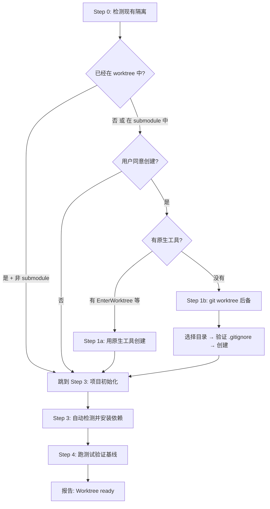

# 00 — Using Git Worktrees（工作区隔离）

## 这个技能干什么

确保所有开发工作在**隔离的工作区**中进行，而不是在主 repo 目录里直接改代码。它用平台原生工具（如 `EnterWorktree`）或 git worktree 作为后备方案，创建一个完全独立的开发环境。

**核心原则：检测先行 → 原生优先 → git 后备。永远不要和平台对抗。**

## 什么时候触发

开始任何 feature 开发之前（通常在 `executing-plans` 或 `subagent-driven-development` 之前）。`writing-plans` 完成后，执行计划之前，先确保在隔离工作区中。

## 怎么用 — 完整流程



### Step 0: 检测现有隔离

**在创建任何东西之前，先检查你是否已经在隔离工作区中。** 这是一个关键步骤——在已经有 worktree 的情况下再创建 worktree（嵌套）会导致混乱。

```bash
GIT_DIR=$(cd "$(git rev-parse --git-dir)" 2>/dev/null && pwd -P)
GIT_COMMON=$(cd "$(git rev-parse --git-common-dir)" 2>/dev/null && pwd -P)
```

- `GIT_DIR == GIT_COMMON` → 普通 repo，需要创建 worktree
- `GIT_DIR != GIT_COMMON` → 已经在链接 worktree 中（但还要验证不是 submodule）

**Submodule 陷阱**：`GIT_DIR != GIT_COMMON` 在 git submodule 中也成立。在断定"已经在 worktree 中"之前，先确认不是 submodule：

```bash
git rev-parse --show-superproject-working-tree 2>/dev/null
# 有输出 → submodule，不是 worktree，按普通 repo 处理
```

### Step 1a: 原生工具优先

如果你有平台提供的原生 worktree 工具（`EnterWorktree`、`WorktreeCreate`、`/worktree` 命令、`--worktree` 标志），**必须使用它**，不要用 `git worktree add`。

**为什么？** 原生工具会处理目录位置、分支创建、会话切换、清理等所有事情。如果你绕过原生工具直接用 `git worktree add`，会创建平台不知道的"幽灵状态"——它无法管理、无法清理、可能导致冲突。

### Step 1b: Git Worktree 后备（仅当没有原生工具时）

#### 目录选择优先级

1. **用户已声明的偏好** > 2. 已有 `.worktrees/` > 3. 已有 `worktrees/` > 4. 全局 `~/.config/superpowers/worktrees/` > 5. 默认 `.worktrees/`

两个都存在时，`.worktrees` 优先于 `worktrees`。

#### 安全性验证（项目本地目录必须做）

```bash
git check-ignore -q .worktrees 2>/dev/null
```

如果目录没有被 `.gitignore` 忽略，必须先添加 `.gitignore` 条目并 commit，**然后**才能创建 worktree。跳过这一步可能导致 worktree 内容被意外追踪和提交。

### Step 3: 项目初始化

自动检测并安装依赖：

```bash
# Node.js
if [ -f package.json ]; then npm install; fi

# Rust
if [ -f Cargo.toml ]; then cargo build; fi

# Python
if [ -f requirements.txt ]; then pip install -r requirements.txt; fi
if [ -f pyproject.toml ]; then poetry install; fi

# Go
if [ -f go.mod ]; then go mod download; fi
```

### Step 4: 验证干净基线

跑测试确保工作区从干净状态开始：

```bash
npm test / cargo test / pytest / go test ./...
```

**如果测试失败**：报告失败，问用户是否继续还是先调查。不要默默带着失败的测试开始开发——你以后无法区分是新增的 bug 还是已有的问题。

**如果测试通过**：报告就绪。

## 核心概念

### "不要和平台对抗"

这是 using-git-worktrees 最核心的设计原则。步骤顺序就是它的体现：

1. 先检测（Step 0）——可能已经在了，不要重复创建
2. 原生工具优先（Step 1a）——平台提供的工具知道怎么管理
3. Git 后备（Step 1b）——只在没有任何原生工具时才自己动手

很多 agent 会跳过后两步直接 `git worktree add`。"我知道怎么创建 worktree，不需要工具"——这就是在对抗平台。结果：平台不知道这个 worktree 的存在，后续的清理、切换、状态管理都会出问题。

### 环境检测逻辑

这个技能包含一个微妙但重要的判断逻辑：你的环境类型决定后续行为的选项。

- **普通 repo**（`GIT_DIR == GIT_COMMON`）：需要创建 worktree
- **链接 worktree + 有分支名**：正常开发环境，4 选项
- **链接 worktree + detached HEAD**：外部管理工作区（如 CI），3 选项（没有本地合并）
- **Submodule**：按普通 repo 处理

这个判断逻辑被 `finishing-a-development-branch` 复用——收尾时根据环境类型提供不同的选项。

## Red Flags — 绝对不能做

- **绝不在已有 worktree 中再创建 worktree**（嵌套 worktree）
- **绝不用 `git worktree add` 当你有原生工具时**（这是 #1 错误）
- **绝不跳过 .gitignore 验证**（可能导致 worktree 内容污染 git 历史）
- **绝不跳过基线测试**（带着失败的测试开始开发 = 灾难）
- **绝不跳过 Step 0 的检测**（每次都要先检测再行动）

## 常见问题

**Q: 已经在 worktree 中了，还要做什么？**
跳到 Step 3（项目初始化）和 Step 4（基线测试）。你已经在隔离环境里了，不要创建新的。

**Q: 原生工具创建 worktree 失败了？**
告诉用户失败原因。不要自己切到 git worktree 后备——原生工具失败通常意味着环境有问题，换方案不会解决根本问题。

**Q: 用户不让创建 worktree？**
服从。在当前目录工作（Step 3 + 4）。但告诉他们：没有隔离的话，当前分支的改动会和开发改动混在一起。

**Q: Sandbox 阻止了 git worktree add？**
告诉用户 sandbox 阻止了创建，在当前目录继续工作。

## 注意事项

- 目录选择严格遵守优先级顺序——用户说了算，然后是项目现有约定，最后才是默认值
- 全局目录（`~/.config/superpowers/worktrees/`）不需要 .gitignore 验证（它在项目外）
- 项目本地目录**必须**被 .gitignore 忽略
- 基线测试失败时不要默默继续——这是你需要知道的信息

## 与其他技能的关系

```
using-git-worktrees → subagent-driven-development / executing-plans → finishing-a-development-branch
                           ↑
                    finishing 也依赖 worktree 的环境检测逻辑来决定提供哪些选项
```
