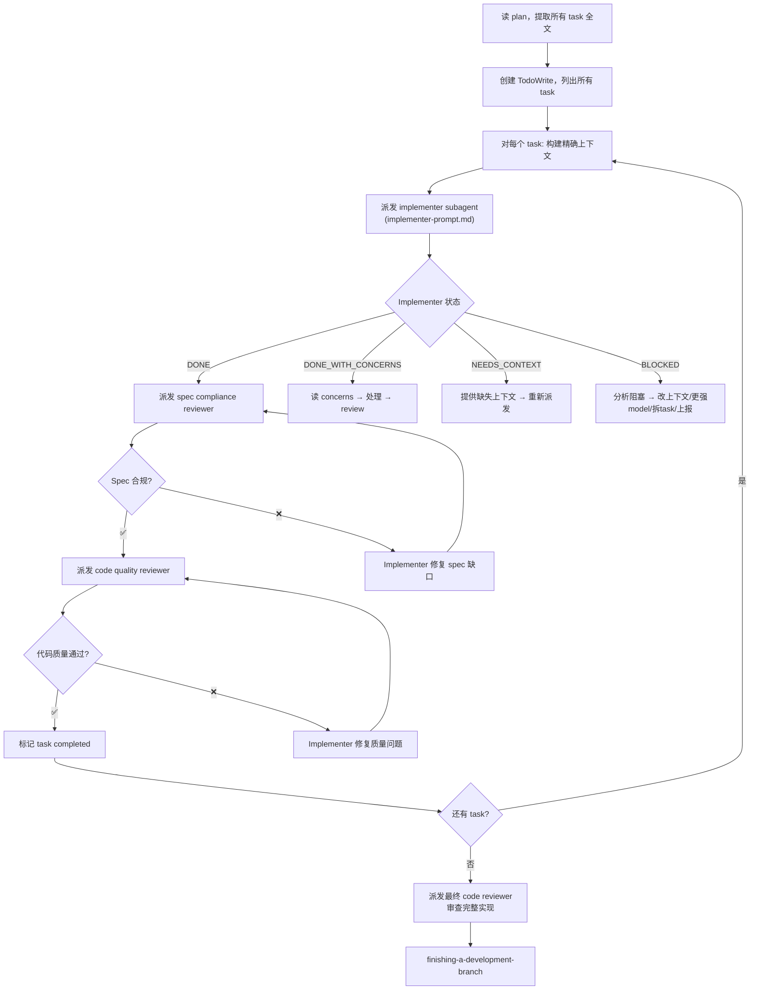

# 01 — Subagent-Driven Development（Subagent 驱动开发）

## 这个技能干什么

用一个全新的 subagent 来执行 plan 中的每一个 task，每个 task 完成后经过**两阶段 review**（spec 合规 + 代码质量），然后再进入下一个 task。每个 subagent 得到精确构建的上下文——它不继承你当前 session 的任何历史，只看到和当前 task 相关的内容。

**核心原则：全新 subagent + 两阶段 review（spec 然后 code quality）= 高质量 + 快速迭代。**

## 为什么需要 SDD

初级 `executing-plans` 的问题：一个 agent 在当前 session 中执行所有 task。10 个 task 下来，agent 的上下文里塞满了前面 9 个 task 的细节、中间的讨论、修过的 bug、改过的方向。上下文的信噪比越来越低 → agent 的注意力越来越分散 → 后面的 task 质量越来越差。

SDD 解决这个问题的方法很直接：**每个 task 给一个完全干净的 agent**。它只看到这个 task 的要求和相关的项目上下文。没有前面的干扰，没有历史的困惑。做完就"消失"，下一个 task 又是一个全新 agent。

**vs. Executing Plans 的对比：**
- 同一个 session（不用切换）
- 全新 subagent 每个 task（上下文不污染）
- 两阶段 review（spec + code quality）
- 更快的迭代（task 之间不需要停下问用户）

## 什么时候触发

有一个写好的 implementation plan 要执行，且你的平台支持 subagent 功能。`writing-plans` 完成后，选 "Subagent-Driven（推荐）"。

## 硬门禁

- **绝不在 main/master 分支上启动实现**（需要用户明确同意）
- **绝不跳过任何 review**（spec review 或 code quality review）
- **绝不在 spec 合规确认前开始 code quality review**（顺序错误）
- **绝不派发多个实现 subagent 并行**（会冲突）
- **绝不把 session 历史传给 subagent**（给 task 文本和上下文就行）

## 怎么用 — 完整流程



### 每个 Task 的执行细节

#### 1. 派发 Implementer Subagent

用 `implementer-prompt.md` 模板构建 subagent 提示词。关键要素：
- Task 的完整文本（不引用 plan 文件，subagent 看不到）
- 场景设定上下文（这个 task 在整个项目中的位置和目的）
- 技术栈和约束
- 允许 subagent **在动手前先提问**（如果对需求有疑问）

Subagent 的行为：
1. 先审阅 task 要求，有疑问先问
2. 用 TDD 实现（RED → GREEN → REFACTOR）
3. 跑 verification-before-completion
4. **自我 review**（检查自己的代码有没有问题）
5. Commit
6. 返回状态报告

#### 2. Implementer 的四种返回状态

| 状态 | 含义 | Controller 的行动 |
|------|------|------------------|
| **DONE** | 完成，没有疑虑 | 进入 spec compliance review |
| **DONE_WITH_CONCERNS** | 完成了但有疑虑 | 读 concerns，如果关于正确性/范围则先处理再 review；如果只是观察则记下来继续 |
| **NEEDS_CONTEXT** | 缺少信息无法完成 | 提供缺失的上下文，重新派发 |
| **BLOCKED** | 无法完成 | 分析原因：上下文问题→补充；需要更强推理→升级 model；task 太大→拆分；plan 本身有问题→上报人类 |

**关键**：绝不要忽略 subagent 的升级信号。如果它说做不了，不要用同一个 model 重试——要么给更多上下文，要么换更强 model，要么拆 task，要么改 plan。

#### 3. Spec Compliance Review

派发 spec compliance reviewer subagent。这是 SDD 的独特设计——**先检查有没有按 spec 做对，再检查代码质量**。

- Reviewer 拿到 spec 要求和实现的代码
- 逐行对照：每个 spec 要求都实现了吗？有没有多做 spec 没要求的东西？
- **不要信任 implementer 的报告** — reviewer 必须自己读代码
- ❌ Spec 不合规 → implementer 修复 → 重新 review
- ✅ Spec 合规 → 进入 code quality review

**为什么 spec review 必须在 code review 之前？**
如果代码本身就不符合 spec（少做了、多做了），讨论代码质量没有意义。先确认方向对，再讨论代码好不好。

#### 4. Code Quality Review

派发 code quality reviewer subagent（使用 `code-reviewer.md` 模板）。

- Reviewer 拿到 git diff（BASE_SHA → HEAD_SHA）
- 检查：plan 对齐、代码质量、架构、测试、生产就绪
- ❌ 有问题 → implementer 修复 → 重新 review
- ✅ 通过 → 标记 task completed

#### 5. 最终 Code Review

所有 task 完成后，派发一个 code reviewer subagent 审查**整个实现的 diff**。这个最终 review 能发现跨 task 的问题——单个 task review 看不出来的问题。

### Model 选择策略

SDD 允许（且鼓励）为不同角色选择不同能力的 model：

| 角色 | Model 级别 | 原因 |
|------|-----------|------|
| 机械实现 task（1-2 文件，spec 清晰） | 最便宜 | Plan 写得够清楚，不需要推理能力 |
| 集成/判断 task（多文件协调） | 标准 | 需要 pattern matching |
| 架构/设计/review task | 最强 | 需要设计判断和广泛代码理解 |

**省钱且快**：大部分 task 是机械的（plan 写好之后），用便宜 model。只有少数关键决策点需要最强 model。

## 核心概念

### 上下文隔离（Context Isolation）

SDD 的核心设计。每个 subagent 只看到：
- 当前 task 的完整文本
- 相关的项目上下文（文件路径、技术栈、已有接口）
- Task 在整个项目中的位置（"场景设定"）

它**看不到**：
- 你的 session 历史（前面的讨论、改过的方向）
- 其他 task 的实现细节
- 之前 task 的 review 讨论

为什么？因为上下文越干净，agent 越专注。一个知道太多背景的 agent 会犹豫、会过度设计、会被前面 task 的问题带偏。一个只知道当前 task 的 agent 会直接、高效、聚焦。

### 两阶段 Review 的顺序

SDD 的 review 不是一个大杂烩 review——它是**有严格顺序**的两阶段：

1. **先 Spec Compliance**：做对了吗？（What）
2. **再 Code Quality**：做得好吗？（How）

这个顺序不能颠倒。如果代码不合规，讨论质量是浪费时间。代码符合 spec、质量又好——这才是完成。

### Controller 的角色

在 SDD 中，你（当前的 session agent）是 Controller。Controller 的责任：
- 读 plan，提取所有 task
- 为每个 task 构建精确的 subagent 上下文
- 处理 subagent 的问题（而不是让它们猜）
- 协调 review 流程
- 处理阻塞（升级 model、拆 task、上报）
- **不在 task 之间停下来问用户**（除非真的阻塞或全部完成）

**Continuous execution**：Controller 不应该在 task 之间问"要继续吗？"——用户让你执行 plan，你就执行。唯一停下来的理由：阻塞无法解决、真正的不确定性、全部完成。

## 常见问题

**Q: 为什么不并行派发多个 implementer subagent？**
会冲突。两个 subagent 可能编辑同一个文件，产生合并冲突。SDD 的一个 task 完成后，项目状态改变了——下一个 task 基于新状态执行。并行执行多个 task 需要确保它们完全独立（这是高级 `dispatching-parallel-agents` 的场景）。

**Q: Subagent 问问题怎么办？**
认真回答。Subagent 没有你的上下文，它的疑问可能是真实的缺口。不要催它"直接做就行"——如果它问，说明信息不够。

**Q: Review 反复不过怎么办？**
如果 implementer fix 了 2-3 次还是过不了 review，问题可能不在 implementer——可能是 plan 有问题、task 太大、或者 spec 要求不清楚。升级处理，不要无限循环。

**Q: 和 executing-plans 怎么选？**
有 subagent 功能 → SDD（更快、质量更高）。没有 → executing-plans。同一个 plan 可以两种执行方式——plan 是执行方式无关的。

## 注意事项

- **不要在 subagent prompt 里引用 plan 文件路径**——subagent 看不到你的文件系统。把 task 全文和上下文直接写进 prompt
- **Subagent 的自我 review 不能替代正式 review**——两个都要
- **Spec review 不过时，implementer 修复后必须重新 review**——不要因为"只是个小问题"就跳过
- **Code review 的 severity 不是每件事都是 Critical**——reviewer 被指示"按实际严重程度分类，不是所有事都是 Critical"

## 与其他技能的关系

```
writing-plans（产出 plan）
    ↓
subagent-driven-development（执行 plan）
    ├── 依赖 using-git-worktrees（隔离工作区）
    ├── 依赖 test-driven-development（每个 subagent 内的质量底线）
    ├── 依赖 verification-before-completion（每个 subagent 完成前验证）
    ├── 依赖 requesting-code-review（派发 reviewer subagent 的模板）
    └── 结束后触发 finishing-a-development-branch

subagent-driven-development 是 executing-plans 的升级替代（同层级，二选一）
```
