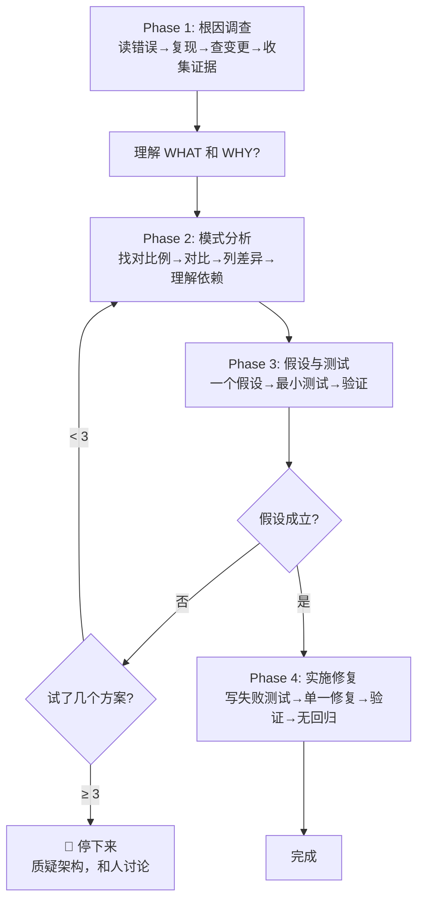

# 02 — Systematic Debugging（系统化调试）

## 这个技能干什么

用一个 4 阶段的科学方法替代"猜一下试试"的调试方式。强制在修复任何 bug 之前先完成根因调查。

**核心原则：永远先找根因，再修 bug。修复症状 = 失败。**

**违反流程的字面规则 = 违反调试的精神。**

## 铁律

```
NO FIXES WITHOUT ROOT CAUSE INVESTIGATION FIRST
（没有先做根因调查 = 不能提修复方案）
```

如果你还没完成 Phase 1（根因调查），你不能提出任何修复方案。哪怕你"确定知道问题在哪"——你确定的是症状，不是根因。

## 什么时候触发

**任何技术问题**——不只限于"大型 bug"：
- 测试失败
- 生产环境 bug
- 意外行为
- 性能问题
- 构建失败
- 集成问题

**尤其在这些时候必须用**：
- 有时间压力时（紧急情况下最容易猜，猜得最错）
- "一个快速修复就行"看起来很明显时（最明显的修复往往是修症状）
- 已经试了多个修复方案时（说明你不理解问题）
- 上次修复没生效时
- 你不完全理解问题时

**不要因为这些原因跳过**：
- 问题看起来很简单（简单问题也有根因，流程对简单 bug 也很快）
- 你很急（着急只会保证返工）
- "现在就修"（系统化比猜测折腾快得多）

## 怎么用 — 4 阶段流程



### Phase 1: 根因调查

**在尝试任何修复之前必须完成的 5 步：**

**1. 认真读错误信息**
- 不要跳过 errors 或 warnings
- 错误信息通常包含确切答案
- 完整读 stack trace
- 注意行号、文件路径、error codes

**2. 稳定复现**
- 能可靠触发吗？
- 确切的复现步骤是什么？
- 每次都发生吗？
- 如果不能复现 → 收集更多数据，不要猜

**3. 检查最近的变更**
- `git diff`、最近 commit、新依赖、配置变更、环境差异

**4. 多组件系统中收集证据**

当系统有多个组件（如 CI → build → signing，或 API → service → database）：

对**每个组件边界**添加诊断日志：
```
对每个边界：
  - 记录什么数据进入了这个组件
  - 记录什么数据离开了这个组件
  - 验证环境/配置的传递
  - 检查每一层的状态

跑一次收集证据，看问题在哪个组件
然后分析证据确定是哪个组件坏了
然后深入调查那个组件
```

示例（多层构建系统）：
```bash
# Layer 1: Workflow
echo "=== Secrets available: ==="
echo "IDENTITY: ${IDENTITY:+SET}${IDENTITY:-UNSET}"

# Layer 2: Build script
echo "=== Env vars in build script: ==="
env | grep IDENTITY || echo "IDENTITY not in environment"

# Layer 3: Signing
echo "=== Keychain state: ==="
security list-keychains
security find-identity -v
```

这能揭示问题在哪一层（secrets → workflow ✓，workflow → build ✗ = build script 的问题）

**5. 追溯数据流**

当错误在调用栈深处时，用 `root-cause-tracing` 技术：
- 坏数据从哪里来的？
- 谁用坏数据调用了这个？
- 一直向上追溯直到找到源头
- 在源头修复，不在症状修复

### Phase 2: 模式分析

**在修复之前先找模式：**

1. **找可工作的例子** — 同一个 codebase 里有什么类似的东西是工作的？
2. **对比参考实现** — 如果在实现一个 pattern，完整读参考实现（不要 skim）
3. **列出差异** — 可工作的和坏掉的之间每一个差异，不要假设"这个差异不可能有关系"
4. **理解依赖** — 这个组件需要什么别的？什么设置、配置、环境？做了什么假设？

### Phase 3: 假设与测试

**科学方法：**

1. **形成一个假设** — 清晰陈述："我认为 X 是根因，因为 Y"。写下来。具体，不模糊
2. **最小化测试** — 做**最小的**可能的改动来测试假设。一次一个变量。不要同时修复多件事
3. **验证后再继续** — 有效？→ Phase 4。无效？→ 形成**新**假设。不要在无效修复上叠更多修复
4. **当你不懂的时候** — 说"我不理解 X"。不要假装懂。请求帮助。继续研究

### Phase 4: 实施修复

**修复根因，不修复症状：**

1. **先写失败测试**（用 TDD 技能）— 最简单的复现，自动化测试
2. **实施单一修复** — 针对根因，一次一个改动，不要混"顺路修一下"
3. **验证修复** — 测试过了吗？其他测试没被破坏？问题真的解决了吗？
4. **如果修复无效**：
   - 停下来数一数：试了几个方案了？
   - < 3 个：回到 Phase 1，用新信息重新分析
   - **如果 ≥ 3 个：🛑 停下来质疑架构**
   - 不要在没有架构讨论的情况下尝试第 4 个方案！

### 当 3+ 个修复失败时：质疑架构

**表明架构问题的模式：**
- 每个修复揭示一个新的共享状态/耦合/问题（在不同的地方）
- 修复需要"大规模重构"才能实施
- 每个修复在其他地方产生新症状

**停下来，质疑基础：**
- 这个模式根本上是正确的吗？
- 我们是不是"靠惯性在坚持它"？
- 应该重构架构还是继续修症状？

**在和 human partner 讨论之前不要再尝试修复。** 这不是失败的假设——这是错误的架构。

## 核心概念

### 为什么猜测性修复如此低效

真实数据（来自实际调试 session）：
- 系统化方法：15-30 分钟修复
- 随机修复方法：2-3 小时的折腾
- 一次修复成功率：95% vs 40%
- 引入新 bug：接近零 vs 常见

猜测修复低效的根本原因：**每次猜测都是盲目的。** 你不知道问题在哪，所以你也不知道改动会不会有效。10% 的概率猜对，90% 的概率浪费时间并可能引入新问题。系统化方法花 10 分钟调查，然后一次修对。

### "没有根因"的情况

如果系统化调查发现问题真的是环境性的、时机依赖的或外部的：
1. 你已经完成了流程（调查本身就是价值）
2. 记录你调查了什么
3. 实施适当的处理（重试、超时、错误消息）
4. 添加监控/日志以备将来调查

**但是**：95% 的"没有根因"案例是不完整的调查。

### 防御纵深（Defense in Depth）

找到根因后，不要只在一个地方修。在 4 层添加验证（`defense-in-depth.md`）：

1. **入口点** — 在数据进入系统时验证
2. **业务逻辑** — 在处理前验证假设
3. **环境保护** — 添加系统级保护
4. **调试仪器** — 留下日志帮助下次调试

"单一验证：'修好了 bug。' 多层验证：'让 bug 变得不可能。'"

真实案例：一个 git-init-in-source-code 的 bug，通过在 4 层添加保护，使 1847 个测试免于同类问题。

### 条件等待（Condition-based Waiting）

`condition-based-waiting.md` 技术：把 `setTimeout`/`sleep` 替换为基于条件的轮询。

原则：**等你真正关心的条件，而不是猜需要等多久。**

```typescript
// ❌ 猜时间
await sleep(5000);

// ✅ 等条件
await waitFor(() => fileExists(path), { timeout: 10000 });
```

真实效果：测试通过率从 60% 提升到 100%，执行速度提升 40%。

## Red Flags — 停下来，回到 Phase 1

如果你发现自己有这些想法，立即停止：

- "快速修一下，之后再调查"
- "试试改 X 看看能不能用"
- "一次改多个地方，一起跑测试"
- "跳过测试，我手动验证"
- "应该是 X，让我修它"
- "我不完全理解，但这个可能有用"
- "模式说 X 但我自己调整一下"
- "这是主要问题：[直接列出修复方案，没有调查]"
- 在追溯数据流之前就提出方案
- **"再试一个修复方案"（已经试了 2+ 次了）**
- **每个修复揭示一个新的问题（在不同的地方）**

**所有这些都意味着：停下来。回到 Phase 1。**

**你的 human partner 的警告信号**：
- "这个不是已经在发生吗？" — 你没有验证就假设了
- "能不能让我们看到…？" — 你应该已经添加了证据收集
- "别再猜了" — 你在不理解的情况下提出修复
- "深想一下这个" — 质疑基础，不只是症状
- "我们卡住了？"（沮丧的语气）— 你的方法不对

## 借口 vs 真相

| 借口 | 真相 |
|------|------|
| "问题简单，不需要流程" | 简单问题也有根因。流程处理简单 bug 也很快 |
| "紧急情况，没时间走流程" | 系统化调试比猜测折腾**更快** |
| "先试一下这个，然后调查" | 第一个修复设定了模式。从一开始就做对 |
| "确认修好了再补测试" | 未经测试的修复不持久。测试先行证明了它 |
| "一次修多处节省时间" | 无法隔离哪个改动有效。会引发新 bug |
| "参考太长了，我调整一下模式" | 部分理解保证 bug。完整读 |
| "我看到问题了，让我修" | 看到症状 ≠ 理解根因 |
| "再试一个修复"（2+ 次失败后） | 3+ 失败 = 架构问题。质疑模式，不要再修 |

## 常见问题

**Q: 一个简单的 typo bug 也要走 4 阶段？**
Typo 本身（如果真的是 typo）Phase 1 就能定位——读错误信息，看到 typo，根因明确。但你至少要走 Phase 1 确认它真的是个 typo。很多"typo"实际上是更深问题的症状。

**Q: 时间压力很大怎么走流程？**
系统化方法比猜测更快——即使你是"着急"的状态。直接跳到 Phase 4 瞎修花 2 小时，走完 Phase 1-4 花 20 分钟。你说哪个更快？

**Q: 用户让我直接修怎么办？**
解释："我可以直接修，但我不确定这是根因。让我花 5 分钟调查一下，然后一次修对。这比试 3 个方案再回来快。"

## 注意事项

- Phase 1 不是"大概看一眼"——是系统化地收集证据
- 测试假设时一次只改变一个变量
- 3 次失败后**必须**质疑架构，禁止试第 4 次
- 系统化调试是刚性技能——不能"根据情况灵活调整"

## 配套技术文件

- `root-cause-tracing.md`：沿调用栈向上追溯找到原始触发点
- `defense-in-depth.md`：找到根因后在多层添加验证
- `condition-based-waiting.md`：用条件轮询替代任意 sleep

## 与其他技能的关系

```
systematic-debugging
    ├── Phase 4 使用 test-driven-development（写回归测试）
    ├── 修复完成后使用 verification-before-completion（验证修复）
    └── 被 subagent-driven-development 和 executing-plans 在执行过程中调用
```
