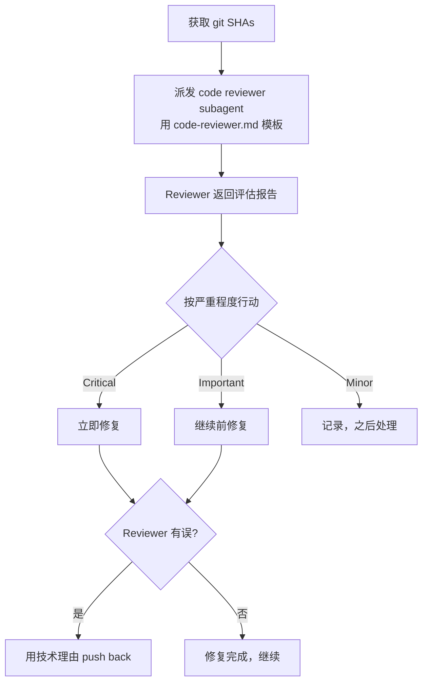

# 03 — Requesting Code Review（请求代码审查）

## 这个技能干什么

派发一个 code reviewer subagent，用精确构建的上下文（git diff + 需求描述）来审查代码。Reviewer 得到一个干净的评估环境——它看不到你的 session 历史，只看到代码本身。这保证了审查的客观性。

**核心原则：早 review，常 review。**

## 什么时候触发

**强制触发**：
- SDD 中每个 task 完成后
- 完成主要 feature 后
- 合并到 main 之前

**可选但有价值**：
- 卡住时（新鲜视角）
- 重构前（基线检查）
- 修复复杂 bug 后

## 怎么用



### 三步操作

**1. 获取 git SHA：**
```bash
BASE_SHA=$(git rev-parse HEAD~1)  # 或 origin/main
HEAD_SHA=$(git rev-parse HEAD)
```

**2. 派发 code reviewer subagent：**

使用 `code-reviewer.md` 模板，填入三个关键信息：
- `{DESCRIPTION}`：你做了什么（简短描述）
- `{PLAN_OR_REQUIREMENTS}`：应该做什么（spec/plan/task 内容）
- `{BASE_SHA}` / `{HEAD_SHA}`：审查的 diff 范围

**3. 对反馈采取行动：**
- **Critical**：立即修复（阻塞性问题、安全漏洞、破坏性变更）
- **Important**：继续之前修复（设计问题、缺失测试、潜在 bug）
- **Minor**：记录下来之后处理（命名建议、代码风格、可选优化）

如果 reviewer 判断错误，用技术理由 push back。不要争论，不要防御——用代码和测试来证明。

## Code Reviewer 的评估框架

`code-reviewer.md` 模板定义了一个完整的审查框架，reviewer subagent 被设定为"高级代码审查员"的角色。它的检查清单包括：

1. **Plan 对齐**：代码实现了 plan/spec 要求的全部内容吗？有没有多做或少做？
2. **代码质量**：逻辑清晰吗？命名好吗？复杂度受控吗？有重复代码吗？
3. **架构**：各部分的组织合理吗？接口设计好吗？关注点分离了吗？
4. **测试**：测试覆盖了核心功能吗？测试真的有价值吗（不是"为了覆盖率"的测试）？edge case 处理了吗？
5. **生产就绪**：有安全问题吗？性能问题？错误处理充分吗？

## Severity 校准

Reviewer 被指示一个关键原则：**按实际严重程度分类，不是所有事都是 Critical。**

- Critical ≠ "我觉得这个应该改"
- Critical = "这会导致生产事故 / 安全漏洞 / 数据丢失"
- Minor = "这可以更好，但不影响功能和安全性"

这个校准避免了 review 变成"所有事都很严重"的噪声——那会导致真正的严重问题被淹没。

## 核心概念

### 为什么用 Subagent 而不是自己 Review

自己 review 自己的代码有两个致命问题：
1. **盲区**：你看不到自己的错误——如果你知道是错的你就不会那么写了
2. **上下文污染**：你知道代码应该做什么，所以你"看到"的代码符合你的意图，而不一定是代码实际在做什么

Subagent reviewer 没有这些盲区。它只看到代码和需求——它要么发现代码符合需求，要么不符合。没有"意图"的干扰。

### Review 时机

**早 review，常 review。** 最糟糕的 review 是合并前的大 review——几千行 diff，reviewer 会累，会 miss 东西，反馈太晚导致返工成本高。

SDD 的设计就是"每个 task 后 review"——diff 很小（几十到几百行），reviewer 能仔细看，反馈及时，修复成本低。

### 当 Reviewer 错了的时候

Reviewer 可能错——它没有完整上下文，可能误判。当你认为 reviewer 错了：
- 用**技术理由**回应，不是防御
- 展示代码/测试证明你的实现是正确的
- 如果 reviewer 缺乏上下文导致误判，补充上下文并请它重新评估
- 如果是架构级别的分歧，升级到 human partner

不要：
- "你不懂这个项目"（这不是技术理由）
- "就是要这么做的"（这没有解释为什么）
- 不解释就当没看见

## 常见问题

**Q: 每个 task 都 review 是不是太多了？**
相反——每个 task 都 review 更高效。每次 review 的 diff 小、reviewer 专注、反馈及时、修复成本低。合并前的大 review（几千行）容易 miss 问题，而且修复成本高。

**Q: Reviewer 反复报 Minor 问题怎么办？**
Minor 问题可以批量处理——在几个 task 的 Minor 问题积累后统一修。但如果同样的 Minor 问题反复出现（比如命名风格），那可能应该升级到 Important——说明 coding 习惯有问题。

**Q: 简单 task 也需要 review 吗？**
强制触发中没有"简单 task 可以跳过"的例外。简单 task 一般 review 也很快——通常就几分钟。"跳过因为简单"是借口模式，和"太简单了不需要测试"是同一类。

## 注意事项

- Reviewer subagent 需要BASE_SHA和HEAD_SHA——**确保 BASE_SHA 是正确的参考点**（通常是上一个 task 结束时的 commit）
- 不要把 session 上下文给 reviewer——只需要 DESCRIPTION、PLAN_OR_REQUIREMENTS、git SHA
- 如果 reviewer 的报告看起来太模糊或太宽泛，检查你是不是提供了足够具体的 `PLAN_OR_REQUIREMENTS`

## 与其他技能的关系

```
requesting-code-review
    ├── 在 SDD 的每个 task 完成后被调用
    ├── 在 SDD 全部完成后被调用（最终 review）
    ├── 在 executing-plans 的每个 task 后可选调用
    ├── reviewer subagent 使用 code-reviewer.md 模板
    └── review 结果被 receiving-code-review 处理（review 反馈的接收态度）
```
