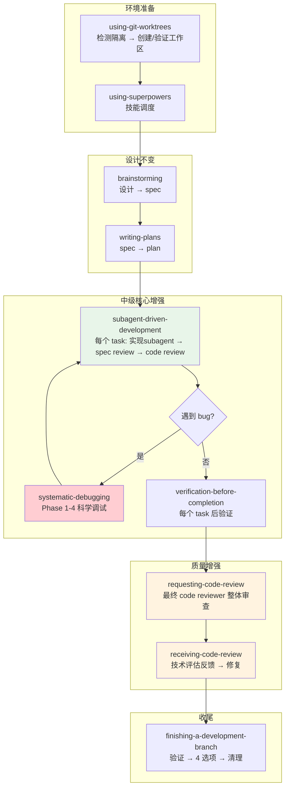

# Superpowers 中级 — 效率与质量增强

## 中级解决什么问题

初级管线解决的是"**能不能做出来**"——从一个想法到一个有测试、可验证、能交付的项目。你已经学会了 brainstorming → plan → TDD → verification → finishing 的完整闭环。

中级解决的是"**能不能更快更好地做出来**"——引入更高级的工具和方法，在初级的质量基础上**提升效率、加深质量**。

具体来说，中级回答 5 个新问题：

1. **怎么保护当前工作区？** → `using-git-worktrees`：在隔离环境中开发，不影响主分支
2. **怎么让多个 task 并行执行？** → `subagent-driven-development`：每个 task 一个独立 subagent，两阶段 review
3. **怎么科学地调试？** → `systematic-debugging`：4 阶段根因分析，消灭"猜 bug"
4. **怎么让别人（机器）review 代码？** → `requesting-code-review`：在问题扩散前捕获
5. **怎么正确地接收 review 反馈？** → `receiving-code-review`：技术评估而非情绪反应

这 5 个技能构成了一个增强层——它们不替代初级管线，而是**在初级管线上叠加**。

---

## 中级 vs 初级的关系

中级不是初级的"升级版"，不会取代它。你在中级阶段做项目时，仍然会走 brainstorming → plan → TDD → verification → finishing 的完整管线。中级技能是在这个管线上的**效率增强**：

| 初级步骤 | 中级增强 |
|---------|---------|
| brainstorming | （不变，设计阶段不需要增强） |
| writing-plans | （不变，plan 质量由初级保证） |
| executing-plans | → **subagent-driven-development**：每个 task 用独立 subagent 执行，更快更专注 |
| TDD（每个 task 内） | （不变，TDD 是永久的质量底线） |
| 运行和调试 | → **systematic-debugging**：遇到 bug 时用科学方法替代猜测 |
| verification-before-completion | （不变，验证是永久的证据门禁） |
| finishing-a-development-branch | → 增强：SDD 完成后用 code review 最终检查 |
| 工作区管理 | → **using-git-worktrees**：用隔离工作区保护主分支 |
| 质量检查 | → **requesting-code-review** + **receiving-code-review**：机器 review 捕获人类（agent）遗漏的问题 |

关键理解：**初级技能在中级仍然全量运行**。TDD 仍然是质量底线。verification-before-completion 仍然是证据门禁。brainstorming 仍然是设计入口。中级只是让你在更大规模、更高复杂度、更快节奏的项目中仍然能维持这些纪律。

---

## 中级技能的选入逻辑

### 为什么是这 5 个

中级 5 个技能分别解决了初级管线在规模扩大时暴露的 5 个痛点：

**痛点 1：工作区混乱**

初级允许在普通 repo 分支上直接开发。当你同时做多个 feature 或者需要保护当前分支时，这就不够了。`using-git-worktrees` 创建隔离的工作区——不污染主分支、多个 feature 可并行、环境完全独立。

**痛点 2：执行效率**

初级 `executing-plans` 在当前 session 中逐步执行所有 task。当项目有 10+ 个 task 时，agent 的上下文会越来越长，注意力会越来越分散。`subagent-driven-development` 给每个 task 分配一个全新的 subagent——上下文干净、注意力集中、两阶段 review 保证质量、不需要在 task 之间停下来问用户。

**痛点 3：调试效率**

初级项目简单，bug 通常很明显。当项目变复杂——多组件、异步、环境差异——"猜一下试试"的调试方式就是灾难。`systematic-debugging` 用 4 阶段科学方法替代猜测：根因调查 → 模式分析 → 假设验证 → 修复实施。真实数据：系统化方法 15-30 分钟修复 vs 猜测方法 2-3 小时折腾。

**痛点 4：质量盲区**

初级依赖 agent 自己保证质量（TDD + verification）。但 agent 会漏东西——agent 和人类一样，都会犯错误，都有盲区。`requesting-code-review` 让另一个 agent 以零上下文的方式审查代码，捕获实现者漏掉的问题。

**痛点 5：review 反馈处理不当**

拿到 code review 反馈后，agent 有两种典型的不良反应：一是表演式接受（"Great point! You're absolutely right!" 然后随便改），二是防御式拒绝（认为 reviewer 不懂上下文）。`receiving-code-review` 教 agent 用技术评估替代情绪反应：验证 → 评估 → 技术性回应或有理有据的 push back。

### 为什么 system debugging 不在初级

初级的排除标准中，`systematic-debugging` 被放在中级。原因：

- **初级项目规模下，TDD + verification 基本能覆盖问题**。如果测试写得好，bug 通常在测试阶段就能发现和定位
- **初级项目通常是单人、单 session**。bug 上下文都在，不需要复杂的证据收集流程
- **系统化调试的 4 阶段流程在初级项目上可能 overkill**。一个简单的 typo bug，不需要 Phase 1-4 全套流程

但当项目变复杂——多组件交互、异步逻辑、环境差异、第三方依赖——猜测式调试的成本急剧上升。这时候就需要系统化方法了。

### 为什么 SDD 和 git worktrees 不在初级

- **SDD 依赖 subagent 功能**，不是所有 AI coding 平台都支持（2026 年仍然如此）。初级技能必须平台无关
- **Git worktrees 依赖平台的工作区管理工具**。不是所有平台都有 `EnterWorktree` 等原生工具。初级允许直接在 repo 分支上工作

---

## 中级管线的设计哲学

### 效率哲学：分离关注点（Separation of Concerns）

中级管线最重要的设计原则：**把不同的关注点分离给不同的 agent**。

在初级中，一个 agent 做所有事：设计、计划、实现、测试、验证、收尾。这个 agent 的上下文里什么都有——需求、代码、测试、bug、review 意见。上下文混乱 → 注意力分散 → 质量下降。

在中级中：
- **规划 agent**（你当前的 session）负责协调：读 plan、分配 task、处理阻塞
- **实现 subagent**（每个 task 一个）负责实现：只看到自己的 task，上下文干净
- **Spec review subagent**（每个 task 一个）负责 spec 合规：只看 spec 和代码的对比
- **Code quality review subagent**（每个 task 一个）负责代码质量：只看代码本身
- **每个 subagent 都是全新上下文**——不继承 session 历史，不被前面的讨论干扰

这种分离的设计结果是：每个 agent 都极度专注，每个 agent 的输出质量都高于一个"什么都做"的 agent。

### 质量哲学：纵深防御（Defense in Depth）

初级有一层质量保障：TDD + verification（agent 自己保证自己的质量）。

中级在这个基础上加了**第二层和第三层**：

**第二层：SDD 的两阶段 review**
- Spec compliance review：实现的东西和 spec 要求的东西完全一致吗？有没有多做（over-building）或少做（missing requirements）？
- Code quality review：代码本身质量好吗？架构合理吗？有安全问题吗？有技术债务吗？

**第三层：独立 code review**
- 在所有 task 完成后，用一个独立的 code reviewer subagent 做最终审查
- 这个 reviewer 看到的是完整的 diff，可以发现跨 task 的问题（单个 task review 看不出来的）

**防御层次总结**：
1. TDD（agent 自己写测试，保证功能正确）
2. Spec compliance review（别人检查有没有按 spec 做）
3. Code quality review（别人检查代码质量）
4. Verification-before-completion（agent 自己跑验证证据）
5. 最终 code review（别人检查完整 diff 的跨 task 问题）

5 层防御，一层比一层难绕过。这就是纵深防御的哲学：**不要信任任何单一防线，多道防线才会安全。**

---

## 完整工作流（中级增强版）



### 中级的典型一次 task 执行流程

以 SDD 的一个 task 为例，展示中级如何叠加在初级之上：

```
1. [中级] Controller 提取 Task 3 的完整文本和上下文
2. [中级] 派发 implementer subagent（全新上下文，只有 Task 3）
3. [初级 TDD] Implementer: RED → 写失败测试 → 验证失败
4. [初级 TDD] Implementer: GREEN → 写最少代码 → 验证通过
5. [初级 TDD] Implementer: REFACTOR → 清理 → 仍绿
6. [初级 VBC] Implementer: 跑验证命令 → 贴输出 → 声称完成
7. [中级 SDD] Implementer: 自我 review → commit
8. [中级] Controller 派发 spec compliance reviewer subagent
9. [中级] Spec reviewer: 逐行对照 spec → ✅ spec compliant
10. [中级] Controller 派发 code quality reviewer subagent
11. [中级] Code reviewer: Strengths + Issues + Assessment → ✅ approved
12. [初级] Controller: 标记 Task 3 completed
```

注意：初级技能（TDD、VBC）在整个过程中持续生效。中级只是加上了 subagent 调度和两阶段 review。

---

## 5 个技能的刚性层级

中级技能中，有些是刚性的（硬约束），有些是柔性的（结构化但可调整）：

**刚性技能：**
- `systematic-debugging`：Iron Law — `NO FIXES WITHOUT ROOT CAUSE INVESTIGATION FIRST`。包含 8 条借口 vs 真相、11 条 Red Flags
- `receiving-code-review`：核心原则不可商量 — "Verify before implementing. Ask before assuming. Technical correctness over social comfort."

**柔性技能：**
- `using-git-worktrees`：流程固定（Step 0→1a→1b→3→4），但路径选择灵活（native vs fallback，目录选择有优先级）
- `subagent-driven-development`：流程固定（每 task: 实现→spec review→code review），但 model 选择、task 拆分可调整
- `requesting-code-review`：触发条件有强制和可选之分，review 深度可调整

---

## 学习建议

### 前提条件

在开始中级之前，确保你：
- 熟练走完初级完整管线（brainstorming → finishing）至少 **3-5 个项目**
- 养成了 TDD 习惯（先写测试、看到失败、再写代码）——不需要有意识提醒自己
- 不再接受没有验证证据的"完成了"
- 至少经历过一次"agent 说完成了但实际没完成"的教训——这样你才会真正理解"证据先行"的价值

### 学习顺序

**第一步：using-git-worktrees（00）**

这是中级里最简单的技能，但也是基础。学会创建隔离工作区——不管是用平台的 EnterWorktree 还是手动 git worktree add。养成习惯：每次开始新 feature 之前，先在隔离环境中工作。

**第二步：subagent-driven-development（01）**

这是中级里最核心、价值最大的技能。找一个你已经写好 plan 的项目（从你的初级练习中找一个），然后用 SDD 执行它。体验：
- Subagent 执行一个 task 有多快？（vs 你自己在当前 session 中执行）
- 两阶段 review 发现了什么你没想到的问题？
- Context 隔离的效果——subagent 没有你的 session 历史，它是不是更专注？

**第三步：systematic-debugging（02）**

等你在 SDD 项目中遇到一个不那么明显的 bug 时（一定会遇到的），走一遍 4 阶段流程。对比一下你以前的"猜-试-猜-试"模式，看看系统化方法花多少时间、猜的方法花多少时间。

**第四步：code review 双技能（03 + 04）**

Code review 是中级里最容易被忽视但价值很高的技能。关键不是"让 agent review 代码"这个动作——而是**用正确的态度接受 review 反馈**。`receiving-code-review` 教的"技术评估而非情绪反应"的思维模式，不只适用于 code review——它适用于你（和你的 agent）收到任何技术反馈的场景。

### 成功标志

- **Worktree 习惯**：你开始新 feature 时，第一反应是"先建个 worktree"
- **SDD 流畅**：写完 plan 后，SDD 执行 5+ task 不需要你干预（除了你主动想 review 的地方）
- **Debug 科学化**：遇到 bug 时，agent 不再猜，而是先说"让我先调查根因"
- **Review 常态化**：每个 task 完成后，你期待看到 review 结果，而不是觉得 review 是负担
- **收到反馈不 defensive**：Agent 收到 review 意见后的反应是"让我验证一下这个建议"而不是"我没错"

---

## 中级技能的完整目录

| 序号 | 文件 | 技能名 | 类型 | 一句话 |
|------|------|--------|------|--------|
| 00 | `00-using-git-worktrees.md` | using-git-worktrees | 柔性 | 创建隔离工作区，保护主分支不受开发中的变更影响 |
| 01 | `01-subagent-driven-development.md` | SDD | 柔性 | 每个 task 一个独立 subagent，两阶段 review（spec + code quality） |
| 02 | `02-systematic-debugging.md` | systematic-debugging | 刚性 | 4 阶段根因分析：调查→模式→假设→修复，禁止猜测 |
| 03 | `03-requesting-code-review.md` | requesting-code-review | 柔性 | 派发 code reviewer subagent，在问题扩散前捕获 |
| 04 | `04-receiving-code-review.md` | receiving-code-review | 刚性 | 技术评估反馈，而非表演式接受或防御式拒绝 |

---

## 进入高级之前

当你能够：
- 熟练用 SDD 执行 10+ task 的项目，流畅不卡
- 用系统化调试在 30 分钟内解决复杂 bug（而不是 3 小时猜谜）
- 自然地使用 code review 作为质量检查点
- 收到 review 反馈后的第一反应是验证，不是辩解

那么你已经做好了进入高级的准备。高级会教你：
- 如何并行调度多个 agent，让它们同时解决不同的问题
- 如何用 TDD 的方法论创造新的 Superpowers 技能——扩展这套方法论本身

转向 `_digest/02-高级/README.md`。
