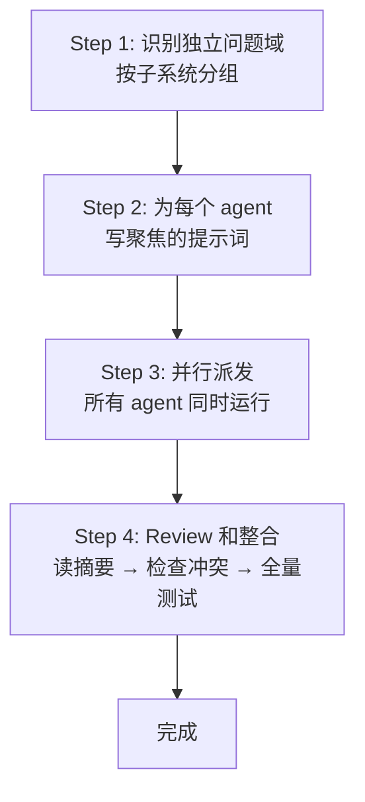

# 00 — Dispatching Parallel Agents（并行调度 Agent）

## 这个技能干什么

当你有 2 个或更多**完全独立**的问题时（不同测试文件、不同子系统、不同 bug），用一个 agent 一个领域地分派，让它们**同时工作**，然后整合结果。

**核心原则：一个 agent 一个独立问题域。让它们同时工作。**

## 什么时候触发

**使用场景：**
- 3+ 个测试文件失败，根因各不相同
- 多个子系统独立损坏
- 每个问题可以在不需要其他问题上下文的情况下理解
- 问题之间没有共享状态

**不要用的场景：**
- 失败是相关的（修复一个可能会修复其他的）——先一起调查
- 需要理解完整系统状态
- Agent 会互相干扰（编辑同一个文件、使用同一资源）
- 探索性调试——你还不知道什么坏了

## 怎么用 — 完整模式



### Step 1: 识别独立问题域

按子系统分组——不是按文件分组，是按**问题域**分组：

```
文件 A 的测试：工具批准流程
文件 B 的测试：批量完成行为
文件 C 的测试：中断功能
```

每个领域是独立的——修复工具批准不会影响中断测试。

**关键判断**：如果修复文件 A 可能会改变文件 B 依赖的行为，那它们**不是独立的**，不能并行。

### Step 2: 创建聚焦的 Agent 提示词

每个 agent 得到：
- **具体范围**：一个测试文件或子系统
- **明确目标**：让这些测试通过
- **约束**：不要改其他代码
- **期望输出**：发现了什么、修复了什么的摘要

**好的提示词结构**（必须 4 要素）：

1. **聚焦的**（Focused）— 一个明确的问题域
2. **自包含的**（Self-contained）— 理解问题所需的所有上下文
3. **具体的输出**（Specific about output）— Agent 应该返回什么？
4. **有约束**（Constrained）— 明确告诉 agent **不要**做什么

```markdown
修复 src/agents/agent-tool-abort.test.ts 中的 3 个失败测试：

1. "should abort tool with partial output capture" — expects 'interrupted at' in message
2. "should handle mixed completed and aborted tools" — fast tool aborted instead of completed
3. "should properly track pendingToolCount" — expects 3 results but gets 0

这些是时序/竞态条件问题。你的任务：

1. 读测试文件，理解每个测试在验证什么
2. 识别根因——时序问题还是实际 bug？
3. 修复方式：
   - 把任意 timeout 替换为基于事件的等待
   - 如果发现 abort 实现中的 bug，修复它
   - 如果测试的行为预期变了，调整测试预期

不要只增加 timeout——找到真正的问题。

返回：你发现了什么、你修复了什么的摘要。
```

### Step 3: 并行派发

```typescript
// Claude Code / AI 环境中
Agent("Fix agent-tool-abort.test.ts failures")
Agent("Fix batch-completion-behavior.test.ts failures")
Agent("Fix tool-approval-race-conditions.test.ts failures")
// 三个同时运行
```

### Step 4: Review 和整合

当 agent 返回后：
1. **读每个摘要**——理解改了什么
2. **检查冲突**——Agent 有没有编辑同一个文件？
3. **跑全量测试**——验证所有修复能一起工作
4. **Spot check**——Agent 可能犯系统性错误

## 核心概念

### 独立性的判断

这是使用这个技能最重要的能力。错误判断独立性会导致 agent 互相踩脚。

**独立的标志：**
- 不同的测试文件
- 不同的子系统/模块
- 不同的根因（修复一个不会影响另一个）
- 修复不需要理解另一个问题的上下文

**不独立的标志：**
- 同一个文件/模块
- 共享状态或依赖
- 修复一个可能会导致另一个的测试预期改变
- 根因可能是同一个（只是表现不同）

**安全原则**：如果不确定是否独立，先顺序调查。确认独立后再并行。

### 提示词的质量决定结果

并行 agent 看不到你的 session 上下文——它们只知道你给的提示词。所以提示词的质量直接决定结果：

| 坏提示词 | 问题 | 好提示词 |
|---------|------|---------|
| "Fix all the tests" | Agent 迷失，不知道范围 | "Fix agent-tool-abort.test.ts" — 聚焦范围 |
| "Fix the race condition" | Agent 不知道在哪、什么样子 | 粘贴错误信息和测试名 |
| 没有约束 | Agent 可能大规模重构 | "Don't change production code" / "Fix tests only" |
| "Fix it" | 你不知道改了什么 | "Return summary of root cause and changes" |

### 和 SDD 的区别

SDD 是**顺序**执行不同的 task（一个接一个）。并行调度是**同时**执行不同的调查/修复。

| | SDD | 并行调度 |
|------|-----|---------|
| 何时用 | 执行 plan 中的 task | 修复多个独立的 bug/失败 |
| 执行方式 | 顺序（task 1 → task 2 → task 3） | 并行（同时） |
| Agent 上下文 | 每个 task 的 plan 文本 | 每个问题域的问题描述 |
| 整合 | Controller 按顺序处理 | 所有完成后一起整合 |
| 冲突风险 | 低（顺序执行避免冲突） | 中（需要检查） |

## 真实案例

来自 2025-10-03 的一次调试 session：

**场景**：大规模重构后，6 个测试失败分布在 3 个文件中。

**失败分布**：
- `agent-tool-abort.test.ts`：3 个失败（时序问题）
- `batch-completion-behavior.test.ts`：2 个失败（tool 不执行）
- `tool-approval-race-conditions.test.ts`：1 个失败（execution count = 0）

**判断**：独立领域——abort 逻辑、batch completion、竞态条件是三个不相关的东西。

**并行派发**：
```
Agent 1 → Fix agent-tool-abort.test.ts
Agent 2 → Fix batch-completion-behavior.test.ts
Agent 3 → Fix tool-approval-race-conditions.test.ts
```

**结果**：
- Agent 1：把 timeout 替换为事件等待
- Agent 2：修复了事件结构 bug（threadId 位置错误）
- Agent 3：添加了等待异步 tool 执行完成的逻辑

**整合**：所有修复独立，零冲突，全量测试通过。

**时间**：3 个问题在 1 个问题的时间内解决。

## 常见问题

**Q: 怎么知道问题是真的独立的？**
问自己：修复 A 会不会改变 B 依赖的东西？如果答案是"可能"——先调查，不要并行。如果不确定——顺序来。

**Q: 如果 agent 改了同一个文件怎么办？**
这就是为什么 Step 4 要检查冲突。如果发现冲突，手动合并——通常并行 agent 改的是同一个文件的不同函数/测试，合并不太难。

**Q: 并行 agent 用完了还要做什么？**
必须跑全量测试。每个 agent 只跑了自己范围内（甚至只跑了特定文件）的测试。全量测试确保没有回归。

## 注意事项

- **不确定独立性 → 不要并行**。错误的并行比顺序更慢（因为要解冲突）
- **提示词必须自包含**，Agent 看不到你的上下文
- **约束是必要的**——告诉 agent **不要**做什么和告诉它要做什么一样重要
- **整合步骤不能跳过**——跑全量测试、检查冲突

## 与其他技能的关系

```
dispatching-parallel-agents
    ├── 依赖你对 subagent 行为的理解（来自 SDD 的经验）
    ├── 每个 agent 内部可以使用 systematic-debugging（如果是调试任务）
    ├── 每个 agent 内部受 verification-before-completion 约束
    └── 整合后的结果可以触发 requesting-code-review
```
