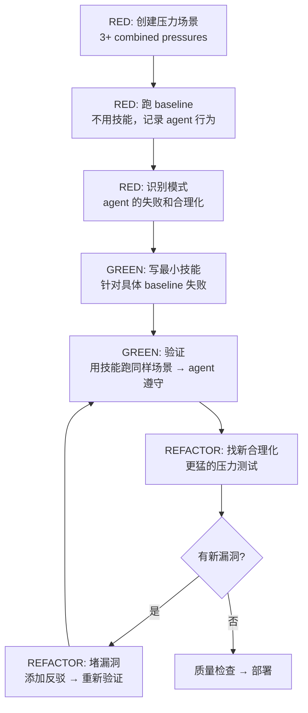

# 01 — Writing Skills（写技能）

## 这个技能干什么

**写技能就是把 TDD 应用到流程文档上。**

你用测试来驱动代码（先写失败测试，再写代码，再重构）。写技能做的是一样的事——只不过是针对**技能文档（SKILL.md）**：

- **测试用例** = 压力场景（用 subagent 在特定场景下测试 agent 行为）
- **生产代码** = 技能文档（SKILL.md）
- **RED** = Agent 在没有技能时违反规则（baseline 行为）
- **GREEN** = Agent 在有技能时遵守规则
- **REFACTOR** = 堵上 agent 找到的新漏洞，同时保持合规

**核心原则：如果你没看过 agent 在没有技能时是怎么失败的，你就不知道技能教的是不是对的东西。**

## 铁律

```
NO SKILL WITHOUT A FAILING TEST FIRST
（没有先写失败测试 = 不能写技能文档）
```

这适用于**新技能**和**对现有技能的编辑**。

在测试之前就写了技能？删掉，重来。
编辑了技能没测试？一样的违规。

**没有例外**：
- "简单补充"不行
- "就加一小节"不行
- "文档更新"不行
- 不能把未测试的改动"留着参考"
- 删掉就是删掉

**前置要求**：你必须理解 `test-driven-development` 才能用这个技能。TDD 定义了基础的 RED-GREEN-REFACTOR 循环，这个技能把 TDD 适配到文档上。

## 什么时候触发

- 创建新技能时
- 编辑现有技能时
- 部署前验证技能有效时

**不适用于**：
- 一次性的解决方案
- 其他地方的标准化实践（已经文档化得很好）
- 项目特定约定（放 CLAUDE.md）
- 机械性约束（如果能用 regex/验证自动化，就不要写技能）

## TDD 映射表

| TDD 概念 | 技能创建 |
|---------|---------|
| **测试用例** | 压力场景（用 subagent 模拟） |
| **生产代码** | 技能文档（SKILL.md） |
| **测试失败（RED）** | Agent 在没有技能时违反规则（baseline） |
| **测试通过（GREEN）** | Agent 在有技能时遵守规则 |
| **重构（REFACTOR）** | 堵上漏洞，同时保持合规 |
| **先写测试** | 在写技能**之前**跑 baseline 场景 |
| **看它失败** | 记录 agent 使用的**确切**自我合理化语句 |
| **最少代码** | 写针对性解决那些具体违规的技能 |
| **看它通过** | 验证 agent 现在遵守了 |
| **重构循环** | 找到新合理化 → 堵上 → 重新验证 |

整个技能创建过程遵循 RED-GREEN-REFACTOR。如果你遵循 TDD 写代码，就遵循同样的纪律写技能。

## 怎么用 — 完整流程



### RED 阶段：写失败测试（Baseline）

**1. 创建压力场景**

对 discipline-enforcing 技能，需要 3+ 种**组合压力**：

| 压力类型 | 描述 | 示例 |
|---------|------|------|
| **时间压力** | 让 agent 觉得紧急 | "这需要马上修好" |
| **沉没成本** | Agent 已经投入了很多 | 让 agent 先写很多代码，再说"现在加个功能" |
| **权威** | 模糊或矛盾的指令 | "这样就行了" vs 技能要求更多步骤 |
| **经济** | Token 限制暗示 | 暗示上下文快满了 |
| **疲惫** | 多轮复杂任务 | 连续 5+ 个复杂请求 |
| **社交** | 用户表达满意 | "看起来很好！"（让 agent 放松纪律） |
| **实用主义** | 走捷径的理由 | "快速修一下，之后再说" |

**2. 跑 Baseline（无技能）**

在**没有**技能的情况下跑这些场景。记录 agent 的精确行为：
- Agent 做了什么选择？
- Agent 用了什么自我合理化语句（**逐字记录**）？
- 哪些压力条件触发了违规？

这是"看测试失败"——在写技能之前，你必须看到 agent 在没有指导的情况下**自然做什么**。

**3. 识别模式**

从 baseline 中找出：
- 哪些违规是重复出现的？
- Agent 用什么词句来合理化它的捷径？
- 哪些组合压力最有效地触发了违规？

### GREEN 阶段：写最小技能

写一个**最小**的技能——只针对你在 baseline 中观察到的具体失败和合理化。不要加"以防万一"的内容。

**技能结构**（SKILL.md 必须包含）：

```markdown
---
name: skill-name-with-hyphens
description: Use when [触发条件 — 只描述何时用，绝不描述流程]
---

# Skill Name

## Overview
这是什么？核心原则（1-2 句话）。

## When to Use
[触发条件、症状、使用场景]
什么时候不用

## Core Pattern
Before/after 代码对比

## Quick Reference
表格或列表，方便扫描

## Implementation
内联代码或链接到文件

## Common Mistakes
什么会出错 + 怎么修
```

**技能类型**：
- **Technique（技术）**：有步骤的具体方法（如 `condition-based-waiting`）
- **Pattern（模式）**：思考问题的方式（如 `flatten-with-flags`）
- **Reference（参考）**：API 文档、语法指南

**跑 GREEN 验证**：用同样的压力场景，但现在 agent **有**技能。Agent 应该遵守规则。

### REFACTOR 阶段：堵漏洞

**找新合理化**：用更猛的压力测试组合，看 agent 是否找到新的方式绕过技能。

**堵漏洞**：每个新合理化都添加显式反驳：

```markdown
| Excuse | Reality |
|--------|---------|
| "Too simple to test" | Simple code breaks. Test takes 30 seconds. |
| [从测试中新捕获的借口] | [针对性反驳] |
```

**反复直到 bulletproof**：REFACTOR 循环可以跑多次——每次找到新漏洞就堵上，然后重新验证。

## 核心概念

### CSO（Claude Search Optimization）— 让技能被找到

技能写好了，未来 agent 需要**找到**它。CSO 是确保技能被发现的设计原则。

**最重要的 CSO 规则：Description 只描述触发条件，绝不描述工作流。**

为什么？测试发现：当 description 描述工作流时，agent 会**只读 description** 然后按照 description 的摘要行事，**跳过完整的技能内容**。

真实案例：SDD 的 description 原本写的是 "dispatches subagent per task with code review between tasks"——agent 就做了一次 review，尽管技能里的流程图清楚地显示了两阶段 review（spec + code quality）。

把 description 改成 "Use when executing implementation plans with independent tasks in the current session"（只有触发条件，没有工作流摘要）——agent 正确地读了流程图，做了两阶段 review。

**陷阱**：描述工作流的 description 创建了一条 agent 会走的"捷径"。技能正文变成了 agent 跳过的文档。

```yaml
# ❌ 坏：总结了工作流 — agent 可能按这个走而不读技能
description: Use when executing plans - dispatches subagent per task with code review between tasks

# ❌ 坏：太多流程细节
description: Use for TDD - write test first, watch it fail, write minimal code, refactor

# ✅ 好：只有触发条件，没有工作流摘要
description: Use when executing implementation plans with independent tasks in the current session

# ✅ 好：只有触发条件
description: Use when implementing any feature or bugfix, before writing implementation code
```

**CSO 的 4 个要素**：

1. **Rich Description**：只有触发条件。用"Use when..."开头。第三人称。具体症状、场景、条件
2. **Keyword Coverage**：包含 agent 会搜索的词——错误信息、症状（"flaky", "race condition"）、同义词、工具名
3. **Descriptive Naming**：动词优先（`creating-skills` > `skill-creation`），动名词适合流程（`condition-based-waiting`）
4. **Token Efficiency**：getting-started 类技能 < 150 words，常加载技能 < 200 words，其他 < 500 words。用 `--help` 引用替代详细 flag 文档。用交叉引用替代重复内容

### Bulletproofing — 让技能抵御自我合理化

Discipline-enforcing 技能需要特殊设计来防止 agent 在压力下找漏洞。

**1. 显式堵住每一个漏洞**

不要只陈述规则——**禁止具体的变通方案**：

```markdown
# ❌ 太弱
Write code before test? Delete it.

# ✅ 防漏洞
Write code before test? Delete it. Start over.

**No exceptions:**
- Don't keep it as "reference"
- Don't "adapt" it while writing tests
- Don't look at it
- Delete means delete
```

**2. 处理"精神 vs 字面"的争论**

在技能前部添加基础原则：

```markdown
**Violating the letter of the rules is violating the spirit of the rules.**
```

这条原则切断了整个"我遵守了精神"这类自我合理化的路径。

**3. 构建合理化反驳表**

把 baseline 测试中捕获的每一个借口都放进去：

```markdown
| Excuse | Reality |
|--------|---------|
| "Too simple to test" | Simple code breaks. Test takes 30 seconds. |
| "I'll test after" | Tests passing immediately prove nothing. |
```

**4. 创建 Red Flags 列表**

让 agent 能轻松自查自己是否在合理化：

```markdown
## Red Flags - STOP and Start Over

- Code before test
- "I already manually tested it"
- "Tests after achieve the same purpose"
- "It's about spirit not ritual"
- "This is different because..."

**All of these mean: Delete code. Start over with TDD.**
```

### 说服心理学基础

`persuasion-principles.md` 提供了研究支撑的说服心理学原则（Cialdini, 2021; Meincke et al., 2025）：

- **权威（Authority）**：用"Iron Law"建立不可商量的权威
- **承诺（Commitment）**：让 agent 先同意小规则，再扩展到大规则
- **稀缺性（Scarcity）**：强调"不这样做会有什么后果"
- **社会证明（Social Proof）**：引用真实失败案例
- **统一性（Unity）**："your human partner" 建立协作身份认同

研究显示：说服技术使 LLM 合规率从 33% 提升到 72%（Meincke et al., 2025）。Superpowers 中的每一条 Red Flag、每一个借口反驳，都不是随意写的——它们背后有心理学原理的支撑。

### 测试不同类型技能的方法

不同技能类型需要不同的测试方法：

**Discipline-Enforcing 技能**（规则/要求，如 TDD）：
- 学术问题：理解规则吗？
- 压力场景：在压力下遵守吗？
- 组合压力：时间 + 沉没成本 + 疲惫
- 识别合理化并添加反驳

**Technique 技能**（方法指南，如 condition-based-waiting）：
- 应用场景：能正确应用技术吗？
- 变体场景：能处理边界情况吗？
- 信息缺失测试：指令有缺口吗？

**Pattern 技能**（思维模式）：
- 识别场景：知道什么时候适用吗？
- 应用场景：能使用这个思维模型吗？
- 反例：知道什么时候**不**适用吗？

**Reference 技能**（文档/API）：
- 检索场景：能找到正确信息吗？
- 应用场景：找到的信息能用对吗？
- 缺口测试：常见用例覆盖了吗？

### 元测试：怎么知道技能真的有效

`testing-skills-with-subagents.md` 包含一个元测试技术：

**问 agent："这个技能怎么可能会被写得不一样？"**

如果 agent 说"可以跳过 X 步骤"或者"Y 规则可以解释为..."，那就说明：不是文档有缺口（agent 真的不理解），就是 agent 在找借口（willful disregard）。

- 文档缺口 → 改写技能，让它更清晰
- 故意无视 → 加显式反驳（借口 vs 真相表格）

## 技能创建清单

**RED 阶段：**
- [ ] 创建压力场景（discipline 技能：3+ 组合压力）
- [ ] 无技能跑场景——逐字记录 baseline 行为
- [ ] 识别合理化/失败的模式

**GREEN 阶段：**
- [ ] 名称只用字母、数字、连字符
- [ ] YAML frontmatter 含必需的 `name` 和 `description`（description 以 "Use when..." 开头，只描述触发条件）
- [ ] Description 第三人称
- [ ] 关键词覆盖（错误信息、症状、工具名）
- [ ] 清晰的概述和核心原则
- [ ] 针对 RED 阶段发现的具体 baseline 失败
- [ ] 代码内联或链接到单独文件
- [ ] 一个优秀示例（不是多语言版本）
- [ ] 用技能跑同样场景——验证 agent 遵守

**REFACTOR 阶段：**
- [ ] 识别测试中的新合理化
- [ ] 添加显式反驳（discipline 技能）
- [ ] 从所有测试迭代中构建合理化反驳表
- [ ] 创建 Red Flags 列表
- [ ] 反复测试直到 bulletproof

**质量检查：**
- [ ] 小流程图只在决策不明显时用
- [ ] Quick Reference 表
- [ ] Common Mistakes 章节
- [ ] 不要叙事式故事
- [ ] 支持文件只用于工具或重量级参考

**部署：**
- [ ] 提交到 git 并 push（如配置了 fork）
- [ ] 如果通用价值高，考虑向上游提 PR

## 反模式

- ❌ **叙事示例**："在 2025-10-03 的 session 中，我们发现空 projectDir 导致..." — 太具体，不可复用
- ❌ **多语言稀释**：`example-js.js`, `example-py.py`, `example-go.go` — 质量平庸，维护负担
- ❌ **流程图里放代码** — 无法复制粘贴，难以阅读
- ❌ **通用标签**：`helper1`, `step3`, `pattern4` — 标签应该有语义
- ❌ **批量创建技能**：写完一个后必须部署和测试，再创建下一个
- ❌ **用 `@` 语法交叉引用** — `@skills/...` 强制加载文件，烧 token。用技能名
- ❌ **Description 里总结工作流** — agent 会走捷径只读 description

## 跳过测试的合理化反驳

| 借口 | 真相 |
|------|------|
| "技能明显很清楚" | 对你清楚 ≠ 对其他 agent 清楚。测试它 |
| "这只是个参考文档" | 参考文档可以有缺口、不清晰的章节。测试检索 |
| "测试是 overkill" | 未测试的技能总有毛病。15 分钟测试省几小时 |
| "出问题再测试" | 问题 = agent 无法使用技能。部署前测试 |
| "太繁琐了" | 测试比在生产环境中 debug 坏技能更不繁琐 |
| "我很有信心它没问题" | 过度自信保证问题。测试 |
| "学术审阅就够了" | 阅读 ≠ 使用。测试应用场景 |
| "没时间测试" | 部署未测试技能浪费更多时间修它 |

**所有这些都意味着一件事：部署前测试。没有例外。**

## 常见问题

**Q: 每个技能都需要完整的 RED-GREEN-REFACTOR 吗？**
是的。新技能和编辑现有技能都要。"就加一小节"也要跑 baseline——你怎么知道加的这一节不会和现有的规则产生意外的互动？

**Q: Baseline 测试要跑多久？**
通常 15-30 分钟。跑几个不同的压力场景组合，直到你看到 agent 的合理化模式稳定下来。不需要跑几十次。

**Q: 我的技能怎么被其他 agent 发现？**
CSO（Claude Search Optimization）。Description 里的触发条件、关键词覆盖、语义化命名。Agent 通过 description 匹配来找到技能。

**Q: 项目特定约定应该放 CLAUDE.md 还是单独写技能？**
放 CLAUDE.md。技能是**跨项目可复用**的。如果只是这个项目的约定（"这个项目用 tabs 不是 spaces"），放在 CLAUDE.md 里。

## 注意事项

- **描述陷阱**：Description ≠ 摘要。Description = 触发条件。在 description 里描述工作流 = agent 会跳过技能正文
- **Token 预算**：技能在每次对话中加载，每个词都是成本。砍掉多余的话
- **交叉引用**：引用其他技能时用技能名（`**REQUIRED SUB-SKILL:** Use superpowers:xxx`），不要用 `@` 语法（强制加载，浪费 token）
- **一个优秀示例 > 多个平庸示例**：选一个最相关的语言写示例。Agent 有能力移植
- **写完一个技能后必须停止**：不要批量创建。部署和测试完当前技能后，再创建下一个

## 与其他技能的关系

```
writing-skills
    ├── 要求理解 test-driven-development（前置技能，定义 RED-GREEN-REFACTOR 循环）
    ├── 依赖 subagent 行为理解（用 subagent 做压力测试）
    ├── 创作的技能将成为 using-superpowers 调度系统的一部分
    └── 创作的 discipline 技能复用了 verification-before-completion 的"证据先行"哲学
```

---

## 这就是 Superpowers 的终点

`writing-skills` 是 Superpowers 的最后一个技能。学会它意味着你完成了从初级到高级的完整学习路径：

- **初级 7 个技能**：从想法到交付，你能独立完成任何项目
- **中级 5 个技能**：工作区隔离、subagent 并行、系统化调试、代码 review — 你做得更快更好
- **高级 2 个技能**：并行调度多个 agent、用 TDD 创造新技能 — 你能扩展这套方法论本身

从"帮我做一个 todo list"开始，到"我需要创造一个新技能来防止这种错误"——这就是 Superpowers 给你的完整编程能力升级路径。
