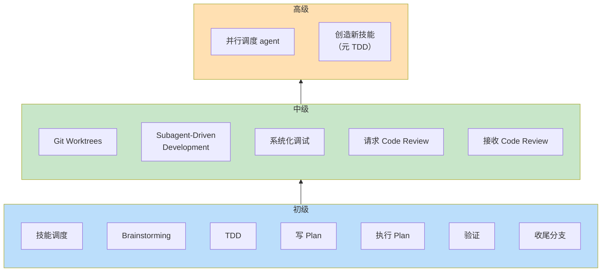
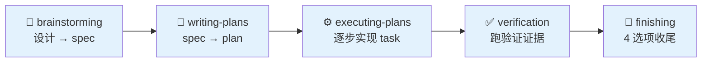
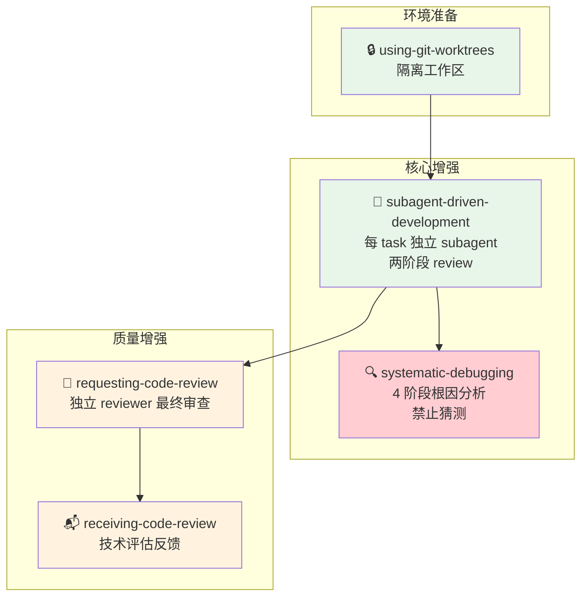
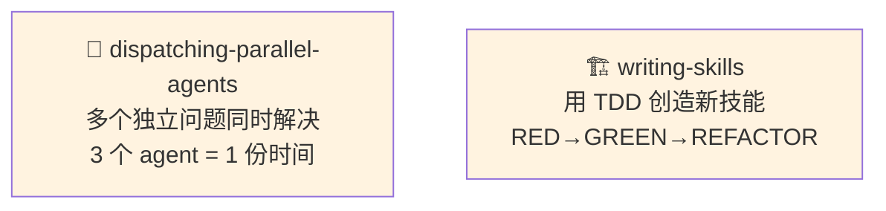

# Superpowers 学习路径

## 这是什么

Superpowers 是一套面向 AI coding agent 的软件开发方法论，由 **14 个技能**组成，分为三个层级。

它不是"教你写代码"的教程。它是**教你如何指挥 AI agent 可靠地完成软件开发**的工作纪律。

---

## 学习路线图

```mermaid
graph TD
    subgraph 入门前提
        PRE["✅ 会用 AI agent 完成简单编程任务<br/>✅ 理解基本的 git、测试、代码 review"]
    end

    PRE --> L1

    subgraph 第一阶段：初级
        L1["🎯 初级 — 7 个技能<br/>目标：能做出来"]
    end

    L1 --> CHECK1{"完成 3-5 个<br/>初级项目？"}
    CHECK1 -->|"TDD 已养成习惯"| L2

    subgraph 第二阶段：中级
        L2["⚡ 中级 — 5 个技能<br/>目标：更快更好地做出来"]
    end

    L2 --> CHECK2{"熟练 SDD 执行<br/>10+ task 项目？"}
    CHECK2 -->|"遇到真实并行需求"| L3

    subgraph 第三阶段：高级
        L3["🔧 高级 — 2 个技能<br/>目标：扩展方法论本身"]
    end

    style L1 fill:#e3f2fd
    style L2 fill:#e8f5e9
    style L3 fill:#fff3e0
```

---

## 三个层级



**关键理解：每一层叠加在上一层之上，不替代。**

初级技能在高级阶段仍然全量运行。即使用上了并行 agent 调度，TDD 仍然是质量底线，verification 仍然是证据门禁。

---

## 初级：能不能做出来（7 技能）

**解决的问题：** 拿到一个想法后，怎么用 AI agent 把它变成一个能交付、有测试、可验证的项目？



**贯穿全流程的纪律：**

| 技能 | 类型 | 贯穿范围 |
|------|------|---------|
| `using-superpowers` | 调度中心 | 整个 session |
| `test-driven-development` | Iron Law | 写任何代码时 |

**完整管线：** brainstorming → writing-plans → executing-plans（内含 TDD 循环）→ verification-before-completion → finishing-a-development-branch

→ 详见 [00-初级/README.md](./00-初级/README.md)

---

## 中级：能不能更快更好地做出来（5 技能）

**解决的问题：** 初级让你能交付，但项目变大后暴露 5 个痛点——工作区混乱、执行效率低、调试靠猜、质量盲区、review 反馈处理不当。



**中级叠加在初级之上：** 你仍然走 brainstorming → plan → TDD → verification → finishing，中级只是在各环节注入效率增强。

→ 详见 [01-中级/README.md](./01-中级/README.md)

---

## 高级：能不能扩展方法论本身（2 技能）

**解决的问题：** 这是"元方法"——不是怎么用 Superpowers，而是怎么扩展它。



→ 详见 [02-高级/README.md](./02-高级/README.md)

---

## 技能全景图

| # | 层级 | 技能 | 类型 | 一句话 |
|---|------|------|------|--------|
| 1 | 初级 | `using-superpowers` | 柔性/调度 | 技能发现与调度中心，整个 session 的"操作系统" |
| 2 | 初级 | `brainstorming` | 柔性/关卡 | 在写代码之前先做设计：需求 → spec |
| 3 | 初级 | `test-driven-development` | **刚性/Iron Law** | RED → GREEN → REFACTOR，不可商量 |
| 4 | 初级 | `writing-plans` | 柔性/关卡 | spec → 可执行的实现 plan |
| 5 | 初级 | `executing-plans` | 柔性/操作 | 逐 task 执行 plan，每 task 跑 TDD |
| 6 | 初级 | `verification-before-completion` | **刚性/Iron Law** | 没有验证证据 = 没有完成 |
| 7 | 初级 | `finishing-a-development-branch` | 柔性/关卡 | 4 选项收尾：merge / PR / archive / discard |
| 8 | 中级 | `using-git-worktrees` | 柔性/环境 | 创建隔离工作区，保护主分支 |
| 9 | 中级 | `subagent-driven-development` | 柔性/执行 | 每 task 独立 subagent，两阶段 review |
| 10 | 中级 | `systematic-debugging` | **刚性/Iron Law** | 4 阶段根因分析，NO FIXES WITHOUT ROOT CAUSE |
| 11 | 中级 | `requesting-code-review` | 柔性/质量 | 派发 code reviewer subagent 整体审查 |
| 12 | 中级 | `receiving-code-review` | **刚性/Iron Law** | 技术评估而非情绪反应 |
| 13 | 高级 | `dispatching-parallel-agents` | 柔性/模式 | 独立问题并行分派，同时解决 |
| 14 | 高级 | `writing-skills` | **刚性/Iron Law** | 用 TDD 创造新技能：NO SKILL WITHOUT FAILING TEST |

---

## 学习建议

### 前提条件

- 能用 AI agent 完成简单的编程任务（比如"做一个 todo list"）
- 理解基本的 git、测试、代码 review 概念
- 愿意接受纪律——**先写测试再写代码**不是"推荐"，是底线

### 推进节奏

1. **初级全部（7 技能）**：按 00→06 顺序，每个学完再进下一个。初级是一根管线，跳步 = 后面的技能基础不稳
2. **做 3-5 个初级项目**：巩固 TDD 习惯，直到"先写测试"不需要有意识提醒
3. **中级全部（5 技能）**：按 00→04 顺序，SDD 是核心价值最大的技能
4. **做 10+ 个 SDD 项目**：熟练 subagent 调度、两阶段 review、系统化调试
5. **高级（2 技能）**：等真实需求出现——不要为了学而学

### 成功标志

| 层级 | 你不再需要提醒自己… |
|------|---------------------|
| 初级 | 先写测试。跑验证命令。写 plan 再写代码。 |
| 中级 | 建 worktree。用 SDD 执行 plan。遇到 bug 先调查根因。收到 review 先验证再回应。 |
| 高级 | 判断哪些问题可以并行。发现"这种情况需要一个技能"。 |
