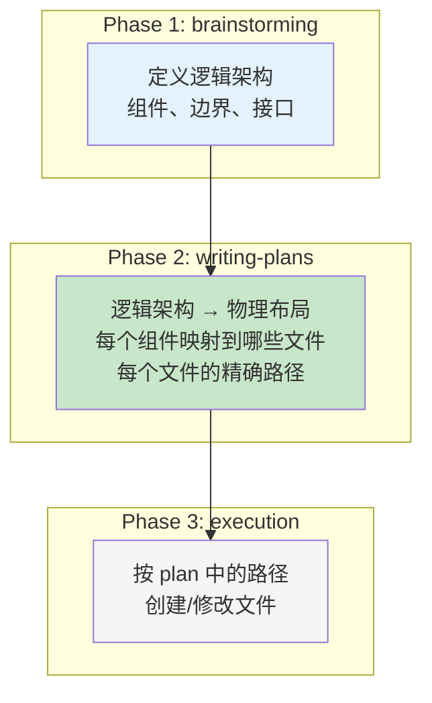
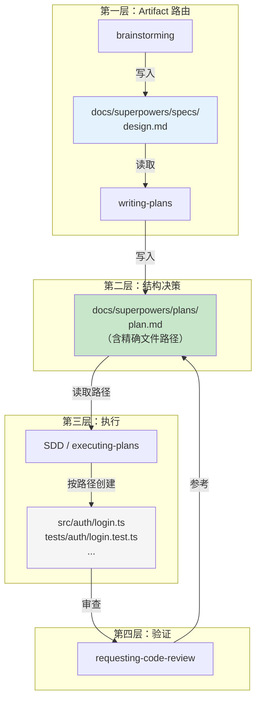

# 00 — 目录结构与工程约定

## 这个问题为什么重要

Superpowers 有 14 个 skill。brainstorming 写了 spec，writing-plans 要能找到它。writing-plans 写了 plan，SDD 和 executing-plans 要能找到它。git-worktrees 创建了 worktree，finishing 要知道怎么清理。

如果目录没有约定，skill 之间就断了。每个 skill 都往不同的地方写，下一个 skill 不知道去哪找——管线就散了。

所以 Superpowers 必须有一组约定，让 14 个 skill 能协调工作。本篇就是挖出这些约定。

---

## 两套约定，两个层次

Superpowers 的目录约定分两层：

| 层次 | 约定内容 | 谁定义的 |
|------|---------|---------|
| **Skill 间 artifact 路由** | spec/plan 放哪、worktree 放哪 | Superpowers 硬编码（用户可覆盖） |
| **项目代码结构** | 每个文件的精确路径 | **plan 定义**（writing-plans 产出） |

第一层让 skill 能找到彼此的产物。第二层是整个项目结构的来源。下面分别展开。

### 负担归属：谁负责什么？

这个问题是理解 Superpowers 设计的关键。三层约定，三个责任方：

| 约定内容 | 谁负责 | 可覆盖？ |
|---------|--------|---------|
| `docs/superpowers/specs/`、`plans/` 路径 | **Superpowers**（硬编码 fallback） | 用户偏好可覆盖 |
| `.worktrees/` 位置和优先级 | **Superpowers**（三个候选，自动选择） | 用户可指定 |
| `.superpowers/brainstorm/` 临时产物 | **Superpowers**（visual-companion 使用） | 否 |
| 项目代码文件路径（`src/auth/login.ts` 等） | **Plan 作者**（writing-plans 阶段决定） | — |
| 是否用 TDD、是否用 worktree | **用户**（CLAUDE.md 最高优先级） | — |

**核心结论：Superpowers 只约定 skill 之间的"路由文件"（spec、plan、worktree）。项目代码的目录结构不在框架层——在 plan 层。** 这就是"Plan 即结构"的含义：约定的产出物是 plan 文件，结构在 plan 里，不是在框架代码里。

---

## 第一层：Skill 间 Artifact 路由

### Artifact 目录：`docs/superpowers/`

Superpowers 约定了一个项目内的 artifact 目录：

```
<project-root>/
└── docs/
    └── superpowers/
        ├── specs/    ← brainstorming 输出
        └── plans/    ← writing-plans 输出
```

文件统一用日期前缀命名：

```
docs/superpowers/specs/2026-05-20-user-auth-design.md
docs/superpowers/plans/2026-05-20-user-auth.md
```

这两个路径**可以被用户偏好覆盖**（brainstorming 和 writing-plans 都写了 "User preferences override this default"）。它们是默认 fallback，不是强制规定。

### `specs/` 和 `plans/` 是扁平目录

**没有子目录。** 所有文件直接放在 `specs/` 和 `plans/` 下，靠日期前缀自然排序：

```
docs/superpowers/
├── specs/
│   ├── 2026-05-18-user-auth-design.md
│   ├── 2026-05-19-payment-module-design.md
│   └── 2026-05-21-notification-system-design.md
└── plans/
    ├── 2026-05-18-user-auth.md
    ├── 2026-05-19-payment-module.md
    └── 2026-05-21-notification-system.md
```

**spec 和 plan 是 1:1 配对的**——同一个日期、同一个 topic slug。spec 文件名多一个 `-design` 后缀，plan 没有。日期前缀让它们自然按时间排序。一个大项目拆成多个子项目时，每个子项目就是一对 spec + plan。

### Spec 文件里面长什么样（具象化）

brainstorming 产出的 spec，核心是一个设计文档。以下是一个真实风格的例子：

```markdown
# User Authentication System — Design

**Date:** 2026-05-18
**Status:** Draft

## Problem
Users can't create accounts or log in. All data is currently public and anonymous.
Need email/password auth with session management.

## Goals
1. Email + password registration and login
2. Session-based auth with HttpOnly cookies
3. Protected API routes via middleware
4. Password reset flow

## Non-Goals
- OAuth / social login (future)
- Role-based access control (future)
- Rate limiting (handled by infra, not app code)

## Architecture
- **Auth service** — handles register/login/logout/reset logic
- **Session store** — Redis-backed, TTL-based
- **Middleware** — Express middleware that checks session on protected routes
- **User model** — email, password_hash, created_at, last_login_at

## Component Diagram
[user → middleware → auth service → session store → DB]

## API Surface
POST   /api/auth/register    — create account
POST   /api/auth/login        — create session
POST   /api/auth/logout       — destroy session
POST   /api/auth/reset        — request password reset
GET    /api/auth/me           — get current user (protected)

## Data Flow
1. User posts credentials → auth service validates → creates session in Redis → sets cookie
2. Protected route → middleware reads cookie → validates session in Redis → attaches user to request
3. Logout → middleware reads cookie → deletes session from Redis → clears cookie

## Key Decisions
- Redis for sessions (not JWT) — enables immediate revocation
- HttpOnly cookies (not localStorage) — XSS-resistant
- bcrypt for password hashing — industry standard
```

### Plan 文件里面长什么样（具象化）

writing-plans 拿到 spec 后，产出可执行的任务列表。每个 task 精确到文件路径：

```markdown
# User Authentication — Implementation Plan

> **For agentic workers:** REQUIRED SUB-SKILL: Use superpowers:subagent-driven-development

**Goal:** Implement email/password auth with Redis-backed sessions and protected API routes

**Architecture:** Express middleware checks session cookie against Redis. Auth service
handles credential validation and password hashing. No OAuth, no RBAC.

**Tech Stack:** Node.js, Express, Redis (ioredis), bcrypt, PostgreSQL (existing)

**Spec:** `docs/superpowers/specs/2026-05-18-user-auth-design.md`

---

### Task 1: Database Migration

**Files:**
- Create: `migrations/2026-05-18-add-users-table.sql`
- Modify: `src/db/schema.ts:1-15`

- [ ] Add users table (id, email, password_hash, created_at, last_login_at)
- [ ] Add unique index on email
- [ ] Update schema.ts with User type
- [ ] Run migration and verify

### Task 2: Auth Service — Core Logic

**Files:**
- Create: `src/auth/service.ts`
- Create: `src/auth/password.ts`
- Test: `tests/auth/service.test.ts`
- Test: `tests/auth/password.test.ts`

- [ ] Implement register(email, password) → creates user, returns session token
- [ ] Implement login(email, password) → validates, returns session token
- [ ] Implement logout(sessionToken) → deletes session
- [ ] Implement getCurrentUser(sessionToken) → returns user or null
- [ ] Password hashing via bcrypt (salt rounds: 12)
- [ ] All functions handle duplicate email, invalid password, expired session

### Task 3: Session Store

**Files:**
- Create: `src/auth/session-store.ts`
- Test: `tests/auth/session-store.test.ts`

- [ ] Implement Redis-backed session store (TTL: 7 days)
- [ ] create(userId) → sessionId
- [ ] validate(sessionId) → userId | null
- [ ] destroy(sessionId) → void
- [ ] Extend session TTL on each validation

### Task 4: Auth Middleware

**Files:**
- Create: `src/auth/middleware.ts`
- Test: `tests/auth/middleware.test.ts`

- [ ] requireAuth middleware — 401 if no valid session
- [ ] attachUser middleware — attaches user to req, doesn't error if unauthenticated
- [ ] Both read session cookie, validate against session store

### Task 5: API Routes

**Files:**
- Create: `src/auth/routes.ts`
- Modify: `src/server/app.ts:10-25`
- Test: `tests/auth/routes.test.ts`

- [ ] POST /api/auth/register
- [ ] POST /api/auth/login
- [ ] POST /api/auth/logout
- [ ] POST /api/auth/reset (placeholder — email sending deferred)
- [ ] GET /api/auth/me (uses requireAuth middleware)
- [ ] Register routes in app.ts

### Task 6: Integration

**Files:**
- Test: `tests/integration/auth-flow.test.ts`

- [ ] End-to-end test: register → login → access protected route → logout → access denied
- [ ] Verify HttpOnly cookie is set
- [ ] Verify password never logged
```

**注意 Plan 的关键结构元素：**
- **Spec 回链**：plan 头部包含 `Spec: docs/superpowers/specs/...`，明确告诉执行者去哪个 spec 对
- **精确路径**：每个 task 的 `Files:` 段列出 `Create:`、`Modify:`、`Test:`，路径没有模糊空间
- **复选框**：每个步骤 `- [ ]`，执行时逐项勾掉

### 为什么是 `docs/superpowers/` 而不是裸 `docs/`

这是有意的隔离——**把 Superpowers 的 agent 间产物和人类的项目文档分开**：

```
docs/
├── README.md              ← 人写给人看的项目文档
├── api-reference.md       ← 同上
└── superpowers/           ← agent 读写的工作产物
    ├── specs/             ← brainstorming → writing-plans 的传递
    └── plans/             ← writing-plans → SDD/execution 的传递
```

混在一起会怎样？agent 在 `docs/` 里翻找 plan 时可能读错文件，人写的文档被当成 plan 处理。

### Worktree 目录

三个候选位置，优先级递减：

| 优先级 | 路径 | 类型 |
|--------|------|------|
| 1（首选） | `.worktrees/` | 项目本地，隐藏，**必须 git-ignored** |
| 2 | `worktrees/` | 项目本地，可见 |
| 3 | `~/.config/superpowers/worktrees/<project>/` | 全局，跨项目共享（legacy） |

选择逻辑：已有目录 > 全局 legacy > 默认 `.worktrees/`。如果 `.worktrees/` 和 `worktrees/` 同时存在，`.worktrees/` 优先。

### Skill 自身的文件组织

`writing-skills` 定义了每个 skill 目录的结构：

```
skills/<skill-name>/
├── SKILL.md              # 主文件（必须）
└── <supporting-file>.*   # 辅助文件（按需，用 ./ 相对路径引用）
```

跨 skill 引用用 `superpowers:skill-name` 标记，不用 `@skills/path/SKILL.md`（`@` 会强制加载整个文件）。

---

## 第二层：项目代码结构——Plan 即结构

### 你没有找到 src/、tests/ 的约定，是因为约定不在这

回头看上面——`docs/superpowers/` 只约定了 spec 和 plan 的位置。Superpowers 确实没有说"源代码必须放 src/，测试必须放 tests/"。

**但这不意味着项目结构是随意的。结构约定在 plan 里。**

### writing-plans 的 task 模板

每个 task 必须指定精确文件路径：

```markdown
### Task 3: User Authentication

**Files:**
- Create: `src/auth/login.ts`
- Create: `src/auth/session.ts`
- Modify: `src/server/middleware.ts:45-78`
- Test: `tests/auth/login.test.ts`
- Test: `tests/auth/session.test.ts`
```

这不是示例——writing-plans 要求 **"Exact file paths always"**。每个 task 里的 `Create:`、`Modify:`、`Test:` 都是精确路径，没有模糊空间。

### SDD implementer prompt：无权改结构

implementer prompt 里写死了：

> "Follow the file structure defined in the plan."
> "If a file you're creating is growing beyond the plan's intent, stop and report it as DONE_WITH_CONCERNS."

Subagent **没有权限**决定文件放哪。想拆文件？停手，上报。文件路径是 plan 阶段定好的，实现阶段只执行。

### 三层结构决策

项目结构不是凭空出现的——它经过三个阶段的逐步细化：



| 阶段 | 决定什么 | 产出 |
|------|---------|------|
| brainstorming | 系统有哪些组件？组件之间怎么交互？ | 逻辑架构（组件图） |
| writing-plans | 每个组件对应哪些文件？文件路径是什么？ | **精确的文件路径列表** |
| execution | 按路径创建文件，实现内容 | 磁盘上的实际文件 |

**这就是 Superpowers 的工程规矩：结构决策在 plan 阶段完成。实现阶段没有结构决策权。**

### 为什么不用固定模板

对比两种方案：

| | 固定模板（Rails/Django 风格） | Superpowers 方式（Plan 即结构） |
|------|------|------|
| 结构来源 | 框架规定 | 每个项目的 plan 定制 |
| 灵活性 | 低——所有项目一样 | 高——每个项目可以有不同布局 |
| 精确度 | 目录级（"controllers 放这"） | 文件级（"这个 task 创建这 3 个文件"） |
| 适用场景 | 特定框架/语言 | **任何语言、任何框架** |
| 结构决策者 | 框架作者 | 项目设计者 + plan 编写者 |

Superpowers 选了右边，因为它的目标是**语言无关、框架无关**。固定模板只有特定生态下才有效——Rails 的 `app/models/` 对 Rust 项目毫无意义。

**Plan 即结构的方案更通用，但也更要求纪律**——你必须真的在 plan 里写好每个文件的精确路径。如果 plan 里路径模糊（"在合适的地方创建 auth 模块"），subagent 就只能自己猜，项目结构就乱了。

### TDD 隐含的局部约定

虽然 Superpowers 没有全局的 "src/ vs tests/" 规定，TDD 技能在局部隐含了一个模式：

```
npm test path/to/foo.test.ts
```

这里 `foo.test.ts` 和 `foo.ts` 在同目录下——**test 文件与源文件 co-located，用 `.test.` 后缀区分**。这不是 Superpowers 的硬性规定（TDD 技能用的语言是 `path/to/test.test.ts` 这样的占位符），但在 TypeScript/JavaScript 生态下是自然模式。

另外 `testing-anti-patterns.md` 提到了 `test-utils/` 目录——放测试辅助函数的共享目录，生产代码不应该从它 import。

这些是**局部约定**——在不同语言/框架下会用对应生态的习惯做法（Python 的 `test_*.py`，Rust 的 `#[cfg(test)] mod tests`），Superpowers 不硬性规定。

---

## 一眼看懂的管线（具象化版）

把 spec 和 plan 的具体文件名放进去，管线就是这样：

```
brainstorming                       writing-plans                      SDD
    │                                    │                               │
    │  写入                               │  读取                          │  读取
    │  docs/superpowers/specs/            │  docs/superpowers/specs/       │  docs/superpowers/plans/
    │  2026-05-18-auth-design.md          │  2026-05-18-auth-design.md     │  2026-05-18-auth.md
    │                                    │                               │
    │                                    │  写入                          │  按 plan 中的路径创建
    │                                    │  docs/superpowers/plans/       │  src/auth/service.ts
    │                                    │  2026-05-18-auth.md            │  src/auth/middleware.ts
    │                                    │                               │  tests/auth/service.test.ts
    ▼                                    ▼                               ▼
```

**关键：plan 文件同时是上游的消费者和下游的生产者。** 它读取 spec，产出路径表；SDD 读取路径表，产出代码文件。

## 完整协调架构

把两层约定合在一起看：



**上下游传递链：**

```
brainstorming → spec 文件          → writing-plans 读取
writing-plans → plan 文件（含路径） → SDD 读取
SDD           → 按路径创建代码文件   → code-review 审查
code-review   → 对照 plan 验证       → 完成
```

每一层的输出文件都在约定的位置，下一层知道去哪找。这就是 14 个 skill 协调运作的基础。

---

## 一个完整项目的结构示例

假设用 Superpowers 做一个 React todo 应用，最终项目可能长这样：

```
react-todo/
├── CLAUDE.md                         # 项目指令
├── .gitignore                        # 必须包含 .worktrees/
├── package.json
├── tsconfig.json
├── docs/
│   └── superpowers/
│       ├── specs/
│       │   └── 2026-05-20-todo-app-design.md    ← brainstorming 产出
│       └── plans/
│           └── 2026-05-20-todo-app.md           ← writing-plans 产出
├── src/                              ← plan 中指定的路径
│   ├── components/
│   │   ├── TodoList.tsx
│   │   ├── TodoItem.tsx
│   │   └── AddTodo.tsx
│   ├── hooks/
│   │   └── useTodos.ts
│   ├── types/
│   │   └── todo.ts
│   ├── App.tsx
│   └── main.tsx
├── tests/                            ← plan 中指定的路径
│   ├── components/
│   │   ├── TodoList.test.tsx
│   │   ├── TodoItem.test.tsx
│   │   └── AddTodo.test.tsx
│   └── hooks/
│       └── useTodos.test.ts
├── test-utils/                       ← 测试辅助（TDD anti-patterns 约定）
│   └── render.tsx
├── .worktrees/                       ← git-ignored
│   └── todo-feature/
└── public/
    └── index.html
```

**谁决定了 `src/components/`、`tests/hooks/` 这些路径？** 不是 Superpowers 的某个全局配置——是 writing-plans 阶段根据项目架构设计的。brainstorming 定义了"需要 TodoList、TodoItem、AddTodo 三个组件，以及一个 useTodos hook"，writing-plans 把它们映射成具体文件路径，SDD 按路径创建。

---

## Skill → 目录映射总表

| Skill | 写入 | 读取 |
|-------|------|------|
| `brainstorming` | `docs/superpowers/specs/` | — |
| `writing-plans` | `docs/superpowers/plans/`（含精确文件路径） | `docs/superpowers/specs/` |
| `executing-plans` / `SDD` | plan 中指定的代码文件 | `docs/superpowers/plans/` |
| `test-driven-development` | test 文件 + src 文件 | — |
| `verification-before-completion` | — | test 命令输出 |
| `using-git-worktrees` | `.worktrees/<branch>/` | `.gitignore` |
| `finishing-a-development-branch` | — | `.worktrees/`（清理判断） |
| `requesting-code-review` | — | 代码 diff + `docs/superpowers/plans/` |
| `receiving-code-review` | — | review 反馈 |
| `writing-skills` | `skills/<name>/SKILL.md` | — |
| `using-superpowers` | — | `skills/` 目录 |

---

## 设计哲学

### 1. Plan 即结构

Superpowers 不给你固定项目模板，但它要求你在 plan 里精确指定每个文件的路径。这不是"没有约定"——这是把结构决策权从框架层移到 plan 层。代价是：plan 必须真的写好路径，不能偷懒。

### 2. 结构决策与实现决策分离

**Plan 阶段决定"文件在哪"，实现阶段决定"文件里写什么"。** implementer subagent 只有实现权，没有结构权。想拆文件？回报，不要自做主张。这条边界保证了即使 10 个 subagent 并行工作，项目结构仍然是统一的——因为它们都在执行同一份 plan 中的路径表。

### 3. 最小共享约定

Superpowers 只对 **skill 之间必须共享的东西**做路径约定：spec、plan、worktree 位置。这三样是 skill 协调的"路由信息"——不约定的话下游找不到上游的产物。

### 4. 语言无关

不规定 `src/` 或 `tests/` 不是疏忽——是为跨语言通用性做的取舍。Rust 的测试写在 `#[cfg(test)] mod tests` 里（和源文件同文件），Python 的测试放 `tests/` 目录下，两者都合法。Superpowers 不做 Judge。

### 5. 用户可覆盖

`docs/superpowers/` 和 worktree 路径都可以被用户偏好覆盖。约定是 fallback，不是教条。

---

## 关键源文件索引

| 约定 | 定义位置 | 原文 |
|------|---------|------|
| `docs/superpowers/specs/` | `skills/brainstorming/SKILL.md:29,111` | "save to `docs/superpowers/specs/YYYY-MM-DD-<topic>-design.md`" |
| `docs/superpowers/plans/` | `skills/writing-plans/SKILL.md:18` | "Save to `docs/superpowers/plans/YYYY-MM-DD-<feature-name>.md`" |
| 用户可覆盖 | brainstorming:112, writing-plans:19 | "(User preferences override this default)" |
| Task 要求精确路径 | `skills/writing-plans/SKILL.md:117` | "Exact file paths always" |
| Implementer 无权改结构 | `skills/subagent-driven-development/implementer-prompt.md:48-51` | "Follow the file structure defined in the plan" / "stop and report DONE_WITH_CONCERNS" |
| Worktree 优先级 | `skills/using-git-worktrees/SKILL.md:71-83` | 已有 > legacy > 默认 `.worktrees/` |
| Worktree 清理判断 | `skills/finishing-a-development-branch/SKILL.md:183,227` | 路径匹配 3 个目录 |
| Skill 文件组织 | `skills/writing-skills/SKILL.md` | `skills/<name>/SKILL.md` + 辅助文件 |
| test-utils 目录 | `skills/test-driven-development/testing-anti-patterns.md:90` | `test-utils/` 放测试辅助函数 |

---

## 真实 Spec 和 Plan 的信息密度（对比 Superpowers 自己的两个项目）

前面给的 user-auth 示例是"教学简化版"。下面用 Superpowers 项目自己真实的 spec/plan 来说明**实际产出物的信息密度**。

### 小项目：Document Review System

| | Spec | Plan |
|---|---|---|
| 文件 | `2026-01-22-document-review-system-design.md` | `2026-01-22-document-review-system.md` |
| 规模 | 137 行 | 302 行（3 个 chunk，5 个 task） |
| 内容密度 | Overview → 两个 reviewer 的详细设计（检查项、输出格式、review loop） → 更新后的 workflow → Markdown 语法规范 → 错误处理 → 文件变更清单 | 每个 task 含：精确文件路径、可执行步骤（带命令）、验证步骤（带预期输出）、commit message |
| 规划粒度 | 设计级别——说什么要改，怎么工作 | Task 里**直接嵌入完整文件内容**（如整个 reviewer prompt template 写在 Step 1 的 code block 里） |

这个项目给了一个清晰的感觉：**spec 定义"什么 + 为什么"，plan 定义"改哪些文件 + 每个文件改什么"。** Plan 不是指向 spec 的链接列表，而是把 spec 的设计决策展开成精确的编辑动作。

### 大项目：Worktree Rototill

| | Spec | Plan |
|---|---|---|
| 文件 | `2026-04-06-worktree-rototill-design.md` | `2026-04-06-worktree-rototill.md` |
| 规模 | **343 行** | **879 行**（3 个 chunk，5 个 task） |
| 内容密度 | Problem（3 个 failure mode）→ Goals（5 条）→ Non-Goals（6 条，明确 Phase 4 的东西不做）→ Design Principles（3 个：detect-not-platform, declarative-prescriptive, provenance-ownership → 逐 section 设计两个 skill 的完整重写（含具体 bash 命令、GIT_DIR 检测、Red Flags 条目）→ Integration Updates（3 个文件的 one-line 修改）→ Bug Fixes 表 → Issues Resolved 表 → **Risks 分析（含跨平台验证数据：50/50 GREEN+PRESSURE 通过率、6 个 harness 的测试状态）** | Task 1 是 **GATE**（验证 Step 1a 在 TDD 框架下 50/50 通过才能继续）→ 完整测试脚本（RED/GREEN/PRESSURE 三阶段，186 行 bash）→ Task 2-3 是**两个 skill 文件的完整替换内容**（分别 ~210 行和 ~230 行 markdown）→ Task 4 是 3 个文件的 one-line 修改 → Task 5 是端到端验证 |

### 信息密度的几个关键观察

**1. Plan 比 Spec 长很多。** Spec 是设计决策，plan 是执行脚本。Document Review 的 plan 是 spec 的 2.2 倍，Worktree Rototill 的 plan 是 spec 的 2.6 倍。因为 plan 里嵌入了完整的文件内容。

**2. Plan 本身就是"可执行的知识"。** Plan 里的 Step 不写"添加 review loop 到 brainstorming"，而是写完整的 markdown 块——"Add this section after the Design section:"，后面跟着要插入的精确文本。implementer subagent 读到的不是方向，是动作。

**3. Spec 的 Non-Goals 是边界。** Worktree Rototill spec 明确列出 6 个 Non-Goals（"Per-worktree env conventions — Phase 4"），防止 scope creep。这和 YAGNI 审查形成配合——reviewer 看到 spec 里标注的 Non-Goals 实现时，直接 flag。

**4. Spec 的 Risks 段是工程判断。** Worktree Rototill spec 最后有详细的 Risks 分析，其中 "Step 1a is the load-bearing assumption" 这个 risk 在实现中确实 materialize 了，但因为 TDD gate（Task 1）捕获了，所以没有造成发布问题。这是 spec → plan 管线中最有价值的反馈回路。

**5. Plan 的第一个 Task 可能是 GATE。** Worktree Rototill 的 Task 1 不是改代码——是写测试、跑 RED、确认失败、跑 GREEN、确认通过。**如果 GREEN 失败超过 2 次 REFACTOR，整个项目停。** 这是信息密度最高的 task——它不是在执行 spec，是在验证 spec 的核心假设是否站立。

### Spec 和 Plan 的实际存储位置

Superpowers 项目自己的 `docs/superpowers/` 里有 5 对 spec + plan：

```
docs/superpowers/
├── specs/
│   ├── 2026-01-22-document-review-system-design.md    (137 lines)
│   ├── 2026-02-19-visual-brainstorming-refactor-design.md
│   ├── 2026-03-11-zero-dep-brainstorm-server-design.md
│   ├── 2026-03-23-codex-app-compatibility-design.md
│   └── 2026-04-06-worktree-rototill-design.md         (343 lines)
└── plans/
    ├── 2026-01-22-document-review-system.md            (302 lines)
    ├── 2026-02-19-visual-brainstorming-refactor.md
    ├── 2026-03-11-zero-dep-brainstorm-server.md
    ├── 2026-03-23-codex-app-compatibility.md
    └── 2026-04-06-worktree-rototill.md                 (879 lines)
```

5 个项目，5 对文件，全扁平。没有子目录。日期前缀 + topic slug 就是全部索引。

---

## Worktree：为什么对很多人很难，Superpowers 怎么解决的

### Worktree 本身为什么难

`git worktree` 是 git 里一个强大但反直觉的功能。几个主要痛点：

1. **不知道自己在不在 worktree 里。** 你 `cd` 进一个目录，跑 `git status`，看起来一切正常——但你其实在一个 linked worktree 里，你的改动不会影响原始目录。Codex App、Cursor、Gemini CLI 都会在背后创建 worktree，用户完全无感。

2. **清理是噩梦。** `git branch -d` 删不掉正在被 worktree 引用的分支。`git worktree remove` 如果你在 worktree 目录里跑会静默失败。删了目录但没跑 `git worktree prune` 会留下僵尸引用。顺序搞错（先删分支还是先删 worktree？）就卡住。

3. **路径约定混乱。** `.worktrees/`、`worktrees/`、`.claude/worktrees/`、`~/.codex/worktrees/`——每个工具往不同地方放。你不知道谁创建的、谁负责清理。

4. **hooks 丢失。** `git worktree add` 创建的新 worktree 不继承主 repo 的 `.git/hooks/`。pre-commit、linter、formatter 全部静默停止——直到你 push 失败才发现。

### Superpowers 的三层解

**第一层：检测代替猜测。**

```bash
GIT_DIR=$(git rev-parse --git-dir)
GIT_COMMON=$(git rev-parse --git-common-dir)
```

`GIT_DIR != GIT_COMMON` → 你已经在 worktree 里了。不需要知道谁创建的、什么工具。这是 git 2.5（2015 年）的稳定 primitive，跨所有平台有效。

三种结果：
- `GIT_DIR == GIT_COMMON` → 普通仓库，没有隔离 → 问用户要不要建 worktree
- `GIT_DIR != GIT_COMMON` + 命名分支 → 已经在 worktree 里 → 跳过创建，直接干活
- `GIT_DIR != GIT_COMMON` + detached HEAD → 外部管理的（如 Codex App sandbox）→ 跳过创建，完成时用缩减菜单

**第二层：原生工具优先，git 命令 fallback。**

Skill 的 Step 1a 让 agent 先检查有没有 `EnterWorktree`、`WorktreeCreate` 这些原生工具。有就用，路径、分支、清理全部托管。没有才走 1b 的 git 命令。

在 Claude Code 上，用户根本不需要知道 `git worktree add` 的语法——agent 调 `EnterWorktree`，一切自动。

**第三层：provenance-based 清理。**

```
.worktrees/ 或 ~/.config/superpowers/worktrees/ → Superpowers 创建的，Superpowers 负责清理
.claude/worktrees/ 或 ~/.codex/worktrees/       → 平台创建的，平台负责，Superpowers 不动
```

加上 bug fix：
- 先 merge → 验证测试 → 删 worktree → 删分支（不是反过来）
- 删 worktree 前先 `cd` 到主 repo 根目录
- 删完跑 `git worktree prune`（自愈僵尸引用）

**对于用户来说，worktree 的使用体验是：**

1. Agent 说："要建个隔离 worktree 保护你的主分支吗？(y/n)"
2. 用户说 y
3. Agent 用 EnterWorktree 或 git worktree add 搞定
4. 工作完成时 Agent 给出 4 个选项（merge/PR/keep/discard），worktree 自动清理

用户不需要知道 `.worktrees/` 在哪、`GIT_DIR` 怎么写、`prune` 是什么。Skill 把这些全包了。
