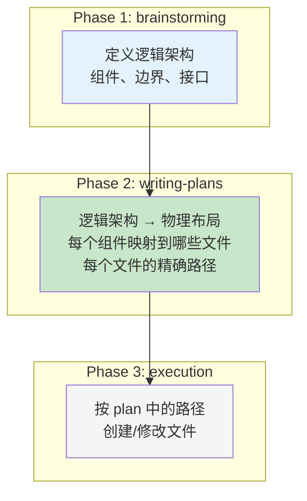
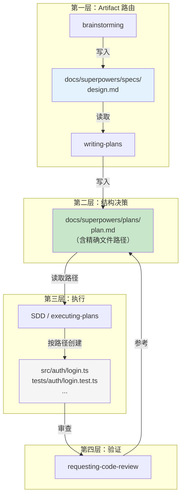

# 00 — 目录结构与工程约定

## 这个问题为什么重要

Superpowers 有 14 个 skill。brainstorming 写了 spec，writing-plans 要能找到它。writing-plans 写了 plan，SDD 和 executing-plans 要能找到它。git-worktrees 创建了 worktree，finishing 要知道怎么清理。

如果目录没有约定，skill 之间就断了。每个 skill 都往不同的地方写，下一个 skill 不知道去哪找——管线就散了。

所以 Superpowers 必须有一组约定，让 14 个 skill 能协调工作。本篇就是挖出这些约定。

---

## 两套约定，两个层次

Superpowers 的目录约定分两层：

| 层次 | 约定内容 | 谁定义的 |
|------|---------|---------|
| **Skill 间 artifact 路由** | spec/plan 放哪、worktree 放哪 | Superpowers 硬编码（用户可覆盖） |
| **项目代码结构** | 每个文件的精确路径 | **plan 定义**（writing-plans 产出） |

第一层让 skill 能找到彼此的产物。第二层是整个项目结构的来源。下面分别展开。

---

## 第一层：Skill 间 Artifact 路由

### Artifact 目录：`docs/superpowers/`

Superpowers 约定了一个项目内的 artifact 目录：

```
<project-root>/
└── docs/
    └── superpowers/
        ├── specs/    ← brainstorming 输出
        └── plans/    ← writing-plans 输出
```

文件统一用日期前缀命名：

```
docs/superpowers/specs/2026-05-20-user-auth-design.md
docs/superpowers/plans/2026-05-20-user-auth.md
```

这两个路径**可以被用户偏好覆盖**（brainstorming 和 writing-plans 都写了 "User preferences override this default"）。它们是默认 fallback，不是强制规定。

### 为什么是 `docs/superpowers/` 而不是裸 `docs/`

这是有意的隔离——**把 Superpowers 的 agent 间产物和人类的项目文档分开**：

```
docs/
├── README.md              ← 人写给人看的项目文档
├── api-reference.md       ← 同上
└── superpowers/           ← agent 读写的工作产物
    ├── specs/             ← brainstorming → writing-plans 的传递
    └── plans/             ← writing-plans → SDD/execution 的传递
```

混在一起会怎样？agent 在 `docs/` 里翻找 plan 时可能读错文件，人写的文档被当成 plan 处理。

### Worktree 目录

三个候选位置，优先级递减：

| 优先级 | 路径 | 类型 |
|--------|------|------|
| 1（首选） | `.worktrees/` | 项目本地，隐藏，**必须 git-ignored** |
| 2 | `worktrees/` | 项目本地，可见 |
| 3 | `~/.config/superpowers/worktrees/<project>/` | 全局，跨项目共享（legacy） |

选择逻辑：已有目录 > 全局 legacy > 默认 `.worktrees/`。如果 `.worktrees/` 和 `worktrees/` 同时存在，`.worktrees/` 优先。

### Skill 自身的文件组织

`writing-skills` 定义了每个 skill 目录的结构：

```
skills/<skill-name>/
├── SKILL.md              # 主文件（必须）
└── <supporting-file>.*   # 辅助文件（按需，用 ./ 相对路径引用）
```

跨 skill 引用用 `superpowers:skill-name` 标记，不用 `@skills/path/SKILL.md`（`@` 会强制加载整个文件）。

---

## 第二层：项目代码结构——Plan 即结构

### 你没有找到 src/、tests/ 的约定，是因为约定不在这

回头看上面——`docs/superpowers/` 只约定了 spec 和 plan 的位置。Superpowers 确实没有说"源代码必须放 src/，测试必须放 tests/"。

**但这不意味着项目结构是随意的。结构约定在 plan 里。**

### writing-plans 的 task 模板

每个 task 必须指定精确文件路径：

```markdown
### Task 3: User Authentication

**Files:**
- Create: `src/auth/login.ts`
- Create: `src/auth/session.ts`
- Modify: `src/server/middleware.ts:45-78`
- Test: `tests/auth/login.test.ts`
- Test: `tests/auth/session.test.ts`
```

这不是示例——writing-plans 要求 **"Exact file paths always"**。每个 task 里的 `Create:`、`Modify:`、`Test:` 都是精确路径，没有模糊空间。

### SDD implementer prompt：无权改结构

implementer prompt 里写死了：

> "Follow the file structure defined in the plan."
> "If a file you're creating is growing beyond the plan's intent, stop and report it as DONE_WITH_CONCERNS."

Subagent **没有权限**决定文件放哪。想拆文件？停手，上报。文件路径是 plan 阶段定好的，实现阶段只执行。

### 三层结构决策

项目结构不是凭空出现的——它经过三个阶段的逐步细化：



| 阶段 | 决定什么 | 产出 |
|------|---------|------|
| brainstorming | 系统有哪些组件？组件之间怎么交互？ | 逻辑架构（组件图） |
| writing-plans | 每个组件对应哪些文件？文件路径是什么？ | **精确的文件路径列表** |
| execution | 按路径创建文件，实现内容 | 磁盘上的实际文件 |

**这就是 Superpowers 的工程规矩：结构决策在 plan 阶段完成。实现阶段没有结构决策权。**

### 为什么不用固定模板

对比两种方案：

| | 固定模板（Rails/Django 风格） | Superpowers 方式（Plan 即结构） |
|------|------|------|
| 结构来源 | 框架规定 | 每个项目的 plan 定制 |
| 灵活性 | 低——所有项目一样 | 高——每个项目可以有不同布局 |
| 精确度 | 目录级（"controllers 放这"） | 文件级（"这个 task 创建这 3 个文件"） |
| 适用场景 | 特定框架/语言 | **任何语言、任何框架** |
| 结构决策者 | 框架作者 | 项目设计者 + plan 编写者 |

Superpowers 选了右边，因为它的目标是**语言无关、框架无关**。固定模板只有特定生态下才有效——Rails 的 `app/models/` 对 Rust 项目毫无意义。

**Plan 即结构的方案更通用，但也更要求纪律**——你必须真的在 plan 里写好每个文件的精确路径。如果 plan 里路径模糊（"在合适的地方创建 auth 模块"），subagent 就只能自己猜，项目结构就乱了。

### TDD 隐含的局部约定

虽然 Superpowers 没有全局的 "src/ vs tests/" 规定，TDD 技能在局部隐含了一个模式：

```
npm test path/to/foo.test.ts
```

这里 `foo.test.ts` 和 `foo.ts` 在同目录下——**test 文件与源文件 co-located，用 `.test.` 后缀区分**。这不是 Superpowers 的硬性规定（TDD 技能用的语言是 `path/to/test.test.ts` 这样的占位符），但在 TypeScript/JavaScript 生态下是自然模式。

另外 `testing-anti-patterns.md` 提到了 `test-utils/` 目录——放测试辅助函数的共享目录，生产代码不应该从它 import。

这些是**局部约定**——在不同语言/框架下会用对应生态的习惯做法（Python 的 `test_*.py`，Rust 的 `#[cfg(test)] mod tests`），Superpowers 不硬性规定。

---

## 完整协调架构

把两层约定合在一起看：



**上下游传递链：**

```
brainstorming → spec 文件          → writing-plans 读取
writing-plans → plan 文件（含路径） → SDD 读取
SDD           → 按路径创建代码文件   → code-review 审查
code-review   → 对照 plan 验证       → 完成
```

每一层的输出文件都在约定的位置，下一层知道去哪找。这就是 14 个 skill 协调运作的基础。

---

## 一个完整项目的结构示例

假设用 Superpowers 做一个 React todo 应用，最终项目可能长这样：

```
react-todo/
├── CLAUDE.md                         # 项目指令
├── .gitignore                        # 必须包含 .worktrees/
├── package.json
├── tsconfig.json
├── docs/
│   └── superpowers/
│       ├── specs/
│       │   └── 2026-05-20-todo-app-design.md    ← brainstorming 产出
│       └── plans/
│           └── 2026-05-20-todo-app.md           ← writing-plans 产出
├── src/                              ← plan 中指定的路径
│   ├── components/
│   │   ├── TodoList.tsx
│   │   ├── TodoItem.tsx
│   │   └── AddTodo.tsx
│   ├── hooks/
│   │   └── useTodos.ts
│   ├── types/
│   │   └── todo.ts
│   ├── App.tsx
│   └── main.tsx
├── tests/                            ← plan 中指定的路径
│   ├── components/
│   │   ├── TodoList.test.tsx
│   │   ├── TodoItem.test.tsx
│   │   └── AddTodo.test.tsx
│   └── hooks/
│       └── useTodos.test.ts
├── test-utils/                       ← 测试辅助（TDD anti-patterns 约定）
│   └── render.tsx
├── .worktrees/                       ← git-ignored
│   └── todo-feature/
└── public/
    └── index.html
```

**谁决定了 `src/components/`、`tests/hooks/` 这些路径？** 不是 Superpowers 的某个全局配置——是 writing-plans 阶段根据项目架构设计的。brainstorming 定义了"需要 TodoList、TodoItem、AddTodo 三个组件，以及一个 useTodos hook"，writing-plans 把它们映射成具体文件路径，SDD 按路径创建。

---

## Skill → 目录映射总表

| Skill | 写入 | 读取 |
|-------|------|------|
| `brainstorming` | `docs/superpowers/specs/` | — |
| `writing-plans` | `docs/superpowers/plans/`（含精确文件路径） | `docs/superpowers/specs/` |
| `executing-plans` / `SDD` | plan 中指定的代码文件 | `docs/superpowers/plans/` |
| `test-driven-development` | test 文件 + src 文件 | — |
| `verification-before-completion` | — | test 命令输出 |
| `using-git-worktrees` | `.worktrees/<branch>/` | `.gitignore` |
| `finishing-a-development-branch` | — | `.worktrees/`（清理判断） |
| `requesting-code-review` | — | 代码 diff + `docs/superpowers/plans/` |
| `receiving-code-review` | — | review 反馈 |
| `writing-skills` | `skills/<name>/SKILL.md` | — |
| `using-superpowers` | — | `skills/` 目录 |

---

## 设计哲学

### 1. Plan 即结构

Superpowers 不给你固定项目模板，但它要求你在 plan 里精确指定每个文件的路径。这不是"没有约定"——这是把结构决策权从框架层移到 plan 层。代价是：plan 必须真的写好路径，不能偷懒。

### 2. 结构决策与实现决策分离

**Plan 阶段决定"文件在哪"，实现阶段决定"文件里写什么"。** implementer subagent 只有实现权，没有结构权。想拆文件？回报，不要自做主张。这条边界保证了即使 10 个 subagent 并行工作，项目结构仍然是统一的——因为它们都在执行同一份 plan 中的路径表。

### 3. 最小共享约定

Superpowers 只对 **skill 之间必须共享的东西**做路径约定：spec、plan、worktree 位置。这三样是 skill 协调的"路由信息"——不约定的话下游找不到上游的产物。

### 4. 语言无关

不规定 `src/` 或 `tests/` 不是疏忽——是为跨语言通用性做的取舍。Rust 的测试写在 `#[cfg(test)] mod tests` 里（和源文件同文件），Python 的测试放 `tests/` 目录下，两者都合法。Superpowers 不做 Judge。

### 5. 用户可覆盖

`docs/superpowers/` 和 worktree 路径都可以被用户偏好覆盖。约定是 fallback，不是教条。

---

## 关键源文件索引

| 约定 | 定义位置 | 原文 |
|------|---------|------|
| `docs/superpowers/specs/` | `skills/brainstorming/SKILL.md:29,111` | "save to `docs/superpowers/specs/YYYY-MM-DD-<topic>-design.md`" |
| `docs/superpowers/plans/` | `skills/writing-plans/SKILL.md:18` | "Save to `docs/superpowers/plans/YYYY-MM-DD-<feature-name>.md`" |
| 用户可覆盖 | brainstorming:112, writing-plans:19 | "(User preferences override this default)" |
| Task 要求精确路径 | `skills/writing-plans/SKILL.md:117` | "Exact file paths always" |
| Implementer 无权改结构 | `skills/subagent-driven-development/implementer-prompt.md:48-51` | "Follow the file structure defined in the plan" / "stop and report DONE_WITH_CONCERNS" |
| Worktree 优先级 | `skills/using-git-worktrees/SKILL.md:71-83` | 已有 > legacy > 默认 `.worktrees/` |
| Worktree 清理判断 | `skills/finishing-a-development-branch/SKILL.md:183,227` | 路径匹配 3 个目录 |
| Skill 文件组织 | `skills/writing-skills/SKILL.md` | `skills/<name>/SKILL.md` + 辅助文件 |
| test-utils 目录 | `skills/test-driven-development/testing-anti-patterns.md:90` | `test-utils/` 放测试辅助函数 |
